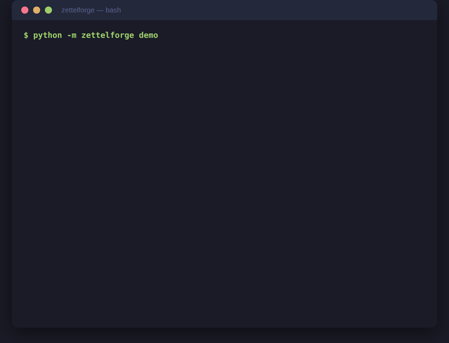

# ZettelForge

**The only agentic memory system built for cyber threat intelligence.**

Give your AI agents persistent memory with entity extraction, knowledge graphs, and STIX ontology -- no cloud, no API keys, works offline.

[](https://pypi.org/project/zettelforge/)
[](https://pepy.tech/projects/zettelforge)
[](https://github.com/rolandpg/zettelforge/stargazers)
[](https://opensource.org/licenses/MIT)
[](https://www.python.org/downloads/)
[](https://github.com/rolandpg/zettelforge/actions)
[](https://github.com/rolandpg/zettelforge/graphs/contributors)
[](https://github.com/rolandpg/zettelforge/commits/master)
[](https://safeskill.dev/scan/rolandpg-zettelforge)

<p align="center">
  
</p>

## Why ZettelForge?

General-purpose memory systems don't understand threat intelligence. They can't tell APT28 from Fancy Bear, don't know that CVE-2024-3094 is the XZ Utils backdoor, and can't track how intelligence evolves across reports. When your agent forgets context between investigations, you end up re-reading the same reports and re-building the same mental models.

ZettelForge was built from the ground up for analysts who think in threat graphs, not chat histories. It extracts CVEs, threat actors, IOCs, and MITRE ATT&CK techniques automatically, resolves aliases across naming conventions, builds a knowledge graph with causal relationships, and retrieves memories using intent-aware blended search -- all offline, with no API keys or cloud dependencies.

| Feature | ZettelForge | Mem0 | Graphiti | Cognee |
|---------|------------|------|----------|--------|
| CTI entity extraction (CVEs, actors, IOCs) | Yes | No | No | No |
| STIX 2.1 ontology | Yes | No | No | No |
| Threat actor alias resolution | Yes (APT28 = Fancy Bear) | No | No | No |
| Knowledge graph with causal triples | Yes | No | Yes | Yes |
| Intent-classified retrieval (5 types) | Yes | No | No | No |
| Offline / local-first (no API keys) | Yes | No | No | No |
| OCSF audit logging | Yes | No | No | No |
| MCP server (Claude Code) | Yes | No | No | No |

## Features

**Entity Extraction** -- Automatically identifies CVEs, threat actors, IOCs (IPs, domains, hashes, URLs, emails), MITRE ATT&CK techniques, campaigns, intrusion sets, tools, people, locations, and organizations. Regex + LLM NER with STIX 2.1 types throughout.

**Knowledge Graph** -- Entities become nodes, co-occurrence becomes edges. LLM infers causal triples ("APT28 *uses* Cobalt Strike"). Temporal edges and supersession track how intelligence evolves.

**Alias Resolution** -- APT28, Fancy Bear, Sofacy, STRONTIUM all resolve to the same actor node. Works automatically on store and recall.

**Blended Retrieval** -- Vector similarity (768-dim fastembed, ONNX) + graph traversal (BFS over knowledge graph edges), weighted by intent classification. Five intent types: factual, temporal, relational, exploratory, causal.

**Memory Evolution** -- With `evolve=True`, new intel is compared to existing memory. LLM decides ADD, UPDATE, DELETE, or NOOP. Stale intel gets superseded. Contradictions get resolved. Duplicates get skipped.

**RAG Synthesis** -- Synthesize answers across all stored memories with direct_answer format.

**Offline-First** -- fastembed (ONNX) for embeddings, llama-cpp-python for LLM features. No API keys, no cloud dependencies.

**OCSF Audit Logging** -- Every operation is logged in OCSF format (FedRAMP AU controls).

## Quick Start

```bash
pip install zettelforge
```

```python
from zettelforge import MemoryManager

mm = MemoryManager()

# Store threat intel -- entities extracted automatically
mm.remember("APT28 uses Cobalt Strike for lateral movement via T1021")

# Recall with alias resolution
results = mm.recall("What tools does Fancy Bear use?")
# Returns the APT28 note (APT28 = Fancy Bear, resolved automatically)

# Synthesize across all memories
answer = mm.synthesize("Summarize known APT28 TTPs")
```

No TypeDB, no Ollama, no Docker -- just `pip install`. Embeddings run in-process via fastembed. LLM features (extraction, synthesis) activate when Ollama is available.

### With Ollama (enables LLM features)

```bash
ollama pull qwen2.5:3b && ollama serve
# ZettelForge auto-detects Ollama for extraction and synthesis
```

### Memory Evolution

```python
# New intel arrives -- evolve=True enables memory evolution:
# LLM extracts facts, compares to existing notes, decides ADD/UPDATE/DELETE/NOOP
mm.remember(
    "APT28 has shifted tactics. They dropped DROPBEAR and now exploit edge devices.",
    domain="cti",
    evolve=True,   # existing APT28 note gets superseded, not duplicated
)
```

## How It Works

Every `remember()` call triggers a pipeline:

1. **Entity Extraction** -- regex + LLM NER identifies CVEs, actors, tools, campaigns, people, locations, orgs (10 types)
2. **Knowledge Graph Update** -- entities become nodes, co-occurrence becomes edges, LLM infers causal triples
3. **Vector Embedding** -- 768-dim fastembed (ONNX, in-process, 7ms/embed) stored in LanceDB
4. **Supersession Check** -- entity overlap detection marks stale notes as superseded
5. **Dual-Stream Write** -- fast path returns in ~45ms; causal enrichment is deferred to a background worker

Every `recall()` call blends two retrieval strategies:

1. **Vector similarity** -- semantic search over embeddings
2. **Graph traversal** -- BFS over knowledge graph edges, scored by hop distance
3. **Intent routing** -- query classified as factual/temporal/relational/causal/exploratory, weights adjusted per type
4. **Cross-encoder reranking** -- ms-marco-MiniLM reorders final results by relevance

## Benchmarks

Evaluated against published academic benchmarks:

| Benchmark | What it measures | Score |
|-----------|-----------------|-------|
| **CTI Retrieval** | Attribution, CVE linkage, multi-hop | **75.0%** |
| **RAGAS** | Retrieval quality (keyword presence) | **78.1%** |
| **LOCOMO** (ACL 2024) | Conversational memory recall | **22.0%** *(with Ollama cloud models)* |

See the [full benchmark report](benchmarks/BENCHMARK_REPORT.md) for methodology and analysis.

## MCP Server (Claude Code)

Add ZettelForge as a memory backend for Claude Code:

```json
{
  "mcpServers": {
    "zettelforge": {
      "command": "python3",
      "args": ["-m", "zettelforge.mcp"]
    }
  }
}
```

Your Claude Code agent can now remember and recall threat intelligence across sessions.

Exposed tools: `remember`, `recall`, `synthesize`, `entity`, `graph`, `stats`.

## Integrations

### ATHF (Agentic Threat Hunting Framework)

Ingest completed [ATHF](https://github.com/Nebulock-Inc/agentic-threat-hunting-framework) hunts into ZettelForge memory. MITRE techniques and IOCs are extracted and linked in the knowledge graph.

```bash
python examples/athf_bridge.py /path/to/hunts/
# 12 hunt(s) parsed
# Ingested 12/12 hunts into ZettelForge
```

See [examples/athf_bridge.py](examples/athf_bridge.py).

## Architecture

```
┌──────────────────────────────────────────────────────────────────────┐
│                           MemoryManager                              │
│  remember()  remember_with_extraction()  recall()  synthesize()      │
├──────────┬───────────┬──────────────┬───────────┬────────────────────┤
│  Note    │  Fact     │   Memory     │  Blended  │   Synthesis        │
│Constructor│ Extractor │  Updater     │ Retriever │   Generator        │
│(enrich)  │(Phase 1)  │(Phase 2)     │(vec+graph)│   (RAG)            │
├──────────┴───────────┴──────────────┼───────────┴────────────────────┤
│       Entity Indexer + Alias        │  Intent Classifier             │
│       Resolver                      │  (factual/temporal/causal)     │
├─────────────────────────────────────┼────────────────────────────────┤
│   Knowledge Graph (JSONL)           │  LanceDB (Vectors)             │
│   Entity nodes + edges              │  768-dim fastembed (ONNX)      │
│   Causal triple inference           │  Zettelkasten notes            │
│   JSONL (TypeDB via extension)      │  IVF_PQ index                  │
└─────────────────────────────────────┴────────────────────────────────┘
```

## Extensions

ZettelForge is a complete, production-ready agentic memory system.
Everything documented above works out of the box.

For teams that need TypeDB-scale graph storage, OpenCTI integration,
or multi-tenant deployment, optional extensions are available:

| Extension | What it adds |
|-----------|-------------|
| TypeDB STIX 2.1 backend | Schema-enforced ontology with inference rules |
| OpenCTI sync | Bi-directional sync with OpenCTI instances |
| Multi-tenant auth | OAuth/JWT with per-tenant isolation |
| Sigma rule generation | Detection rules from extracted IOCs |

Extensions are installed separately:

```bash
pip install zettelforge-enterprise
```

**Hosted option:** [ThreatRecall](https://threatrecall.ai) provides
managed ZettelForge with all extensions, so you don't have to run
infrastructure yourself.

## Configuration

| Variable | Default | Description |
|----------|---------|-------------|
| `AMEM_DATA_DIR` | `~/.amem` | Data directory |
| `ZETTELFORGE_BACKEND` | `sqlite` | SQLite community backend. TypeDB is available via extension. |
| `ZETTELFORGE_LLM_PROVIDER` | `local` | `local` (llama-cpp) or `ollama` |

See [config.default.yaml](config.default.yaml) for all options.

## Contributing

See [CONTRIBUTING.md](CONTRIBUTING.md) for development setup.

## License

MIT -- See [LICENSE](LICENSE).

**Made by Patrick Roland**.

## Acknowledgments

- Inspired by [Zettelkasten](https://en.wikipedia.org/wiki/Zettelkasten) and [A-Mem](https://arxiv.org/abs/2602.10715) (NeurIPS 2025)
- Two-phase pipeline inspired by [Mem0](https://mem0.ai/research)
- STIX 2.1 schema informed by [typedb-cti](https://github.com/typedb-osi/typedb-cti)
- Benchmarked against [LOCOMO](https://snap-research.github.io/locomo/) (ACL 2024) and [CTIBench](https://arxiv.org/abs/2406.07599) (NeurIPS 2024)
- [LanceDB](https://lancedb.com) | [fastembed](https://github.com/qdrant/fastembed) | [Pydantic](https://pydantic.dev) | [TypeDB](https://typedb.com)
