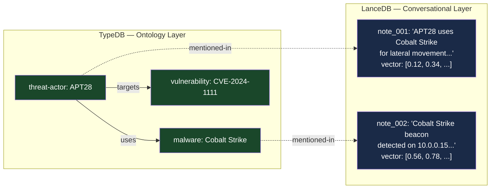

# Why SQLite + LanceDB (Not One or the Other)

ZettelForge uses two storage engines where most systems use one. SQLite handles structured data (notes, knowledge graph, entity index) with ACID guarantees. LanceDB handles vector search. This is a deliberate architectural choice, not accidental complexity.

> **Note:** The optional `zettelforge-enterprise` extension replaces SQLite with TypeDB for teams needing STIX 2.1 schema enforcement and inference rules. The architecture rationale below applies to both backends — only the ontology layer implementation differs.

## The Problem with One Database

CTI analysis operates on two fundamentally different data types:

1. **Structured intelligence** — entities with typed relationships, confidence scores, temporal validity, and ontological constraints. "APT28 uses Cobalt Strike" is a typed relationship between a `threat-actor` and a `malware` entity, with confidence 0.85, valid from January 2024.

2. **Unstructured context** — raw text, analyst notes, news articles, conversation logs. "The ransomware encrypted all files on the domain controller using AES-256" is a passage that should be retrievable by semantic similarity but doesn't decompose cleanly into typed entities.

No single database handles both well:

| Capability | Graph DB alone | Vector DB alone |
|:-----------|:---------------|:----------------|
| Typed relationships | Strong | None |
| Multi-hop traversal | Strong | None |
| Inference rules | Strong (TypeDB) | None |
| Semantic search | None | Strong |
| Unstructured text | Poor fit | Natural fit |
| Schema enforcement | Strong | None |
| Temporal validity | Via edge properties | Via metadata only |
| Alias resolution | Via inference | Manual lookup |

## The Hybrid Decision

**TypeDB owns the truth.** When an analyst asks "what tools does APT28 use?", TypeDB answers definitively from its STIX 2.1 typed relationships. The answer includes confidence scores, temporal validity windows, and can traverse multi-hop paths (APT28 → campaign → malware) using inference.

**LanceDB owns the context.** When an analyst asks "what happened with the ransomware incident?", LanceDB finds semantically similar notes via vector search. The answer is grounded in the actual text the analyst stored, not just entity relationships.

**The bridge is `mentioned-in`.** Every time a note is stored, entity extraction identifies STIX entities in the text and creates `mentioned-in` relations in TypeDB. This means a graph query for "all notes about APT28" traverses TypeDB to find note IDs, then LanceDB retrieves the actual content. The `BlendedRetriever` merges both retrieval paths using intent-based weights.

## Why TypeDB Specifically

The choice of TypeDB over Neo4j, FalkorDB, or ArangoDB was driven by three capabilities:

**1. STIX 2.1 as a native schema.** TypeDB's type system — with abstract entity inheritance, typed relation roles, and attribute constraints — maps naturally to STIX. `threat-actor sub stix-domain-object` inherits 8 shared attributes while adding actor-specific fields. This is schema enforcement, not convention.

**2. Inference functions.** TypeDB can compute relationships that aren't explicitly stored. The `get_aliases` function resolves alias chains transitively — if "Fancy Bear" is aliased to "APT28" and "Strontium" is aliased to "APT28", a query for aliases of "Strontium" returns "Fancy Bear" without a direct edge between them.

**3. Apache-2.0 licensing.** For a CTI platform that may be deployed in government or defense environments, unambiguous open-source licensing matters.

## Why LanceDB Specifically

LanceDB was chosen for the vector layer because:

- **Embedded deployment** — no separate server process, runs in-process via Python
- **IVF_PQ indexing** — balanced performance/accuracy for the 768-dimensional embedding space
- **Columnar storage** — efficient for the append-heavy write pattern of note ingestion
- **Zero external dependencies** — just `pip install lancedb`

## In-Process AI: fastembed + llama-cpp-python

ZettelForge v2.0.0 runs all AI inference in-process by default, with no external service dependencies:

- **Embeddings**: fastembed runs nomic-embed-text-v1.5-Q as an in-process ONNX model (768-dim, ~130 MB, ~7ms/embed). This eliminates the latency and operational overhead of an embedding server.
- **LLM**: llama-cpp-python loads Qwen2.5-3B-Instruct (Q4_K_M GGUF, ~2.0 GB) directly into the Python process (~15.6 tok/s on CPU). This handles fact extraction, intent classification, causal triple extraction, and synthesis.

Both models download automatically on first use. Ollama remains available as an optional fallback provider for users who prefer server-based inference or want to use different models -- configure via `embedding.provider: ollama` and `llm.provider: ollama` in `config.yaml`.

## The Cost of Two Databases

The hybrid architecture adds operational complexity:

- Two data stores to back up
- TypeDB requires Docker (not purely embedded)
- The `mentioned-in` bridge can become inconsistent if one database is modified without the other
- Cache invalidation spans both systems

ZettelForge mitigates this with automatic fallback — if TypeDB is unreachable, `get_knowledge_graph()` returns the JSONL backend transparently. The system degrades to vector-only retrieval rather than failing.

## Intent-Guided Graph Traversal

The `BlendedRetriever` does not run the graph retriever at a fixed weight. It consults the `IntentClassifier` first, then applies an intent-specific traversal policy that controls how much each retrieval source contributes to the final blended score.

### The Five Query Intents and Their Traversal Policies

| Intent | Graph weight | Primary source | Typical CTI query |
|:-------|:------------|:---------------|:------------------|
| `FACTUAL` | 0.2 | entity index (0.7) | "What CVE was used in the SolarWinds attack?" |
| `TEMPORAL` | 0.2 | temporal (0.5) | "What changed since the last incident?" |
| `RELATIONAL` | 0.5 | graph (0.5) | "What infrastructure does APT28 use?" |
| `CAUSAL` | 0.6 | graph (0.6) | "Why did the attacker pivot to the domain controller?" |
| `EXPLORATORY` | 0.2 | vector (0.5) | "Tell me about APT28" |

A `graph` weight of `0.0` means the graph retriever runs but its results are multiplied by zero before accumulating into the blended score — effectively silencing it. This is why intent classification accuracy directly determines whether graph traversal contributes to retrieval at all.

### Why FACTUAL Queries Carry a Non-Zero Graph Weight

FACTUAL queries are entity lookups, and a zero graph weight seems intuitive: if you want to know a specific fact, why traverse the graph? In practice, CTI factual queries frequently span a graph hop. "What CVE does APT28 exploit?" is factual in intent but requires an `(APT28) -[targets]-> (CVE)` traversal to answer correctly. Setting `graph=0.2` for FACTUAL allows graph results to contribute without dominating — the entity index (0.7) still provides the primary answer, and the graph supplements it.

### Classification Accuracy as a Retrieval Quality Gate

The classifier uses two-tier classification: keyword matching (primary) and LLM fallback (when keyword score < 2). A misclassification does not produce a wrong answer — it produces a degraded answer, because the wrong retrieval policy routes the query to the wrong combination of retrievers. A CTI relational query misclassified as FACTUAL will return entity index results rather than graph traversal results. The answer may be plausible but incomplete.

For details on keyword lists, policy weights, and the merge algorithm, see the [Retrieval Policies Reference](../reference/retrieval-policies.md).

## LLM Quick Reference

ZettelForge v2.0.0 uses a hybrid two-database architecture. TypeDB (Apache-2.0, STIX 2.1 schema) serves as the ontology layer owning structured threat intelligence: 9 entity types (threat-actor, malware, tool, attack-pattern, vulnerability, campaign, indicator, infrastructure, zettel-note), 8 relation types (uses, targets, attributed-to, indicates, mitigates, mentioned-in, supersedes, alias-of), inference functions for transitive alias resolution and campaign tool attribution, confidence scoring on every relation, and temporal validity via valid-from/valid-until attributes. LanceDB serves as the conversational layer owning unstructured context: Zettelkasten-style atomic notes with 768-dimensional vector embeddings (fastembed nomic-embed-text-v1.5-Q by default, IVF_PQ index with 256 partitions and 16 sub-vectors), raw text, metadata, and links. Embeddings and LLM inference run in-process by default via fastembed (ONNX) and llama-cpp-python (Qwen2.5-3B-Instruct Q4_K_M GGUF). Ollama is available as an optional fallback provider. The bridge between the two layers is the mentioned-in relation in TypeDB which stores (entity → note-id) mappings. During recall(), the BlendedRetriever queries both layers — VectorRetriever computes cosine similarity with entity boost, GraphRetriever runs BFS from query entities with hop-distance scoring — and merges results using intent-based policy weights (factual queries weight entity index 0.7, relational queries weight graph 0.5, exploratory queries weight vector 0.5). The fallback mechanism returns JSONL KnowledgeGraph if TypeDB is unreachable, degrading to vector-only retrieval. This architecture was chosen because CTI analysis requires both typed structured relationships (which TypeDB handles with schema enforcement and inference) and semantic unstructured text retrieval (which LanceDB handles with vector similarity). Neither database alone covers both needs.
