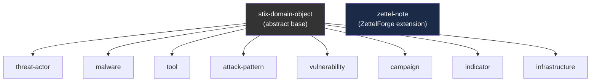

# How STIX 2.1 Maps to ZettelForge

ZettelForge implements a focused subset of STIX 2.1 in TypeDB. This page explains what was included, what was excluded, and why.

## STIX 2.1 in 30 Seconds

STIX (Structured Threat Information Expression) defines three categories of objects:

- **SDOs** (STIX Domain Objects): The things — threat actors, malware, vulnerabilities, campaigns
- **SROs** (STIX Relationship Objects): How things connect — uses, targets, attributed-to
- **SCOs** (STIX Cyber Observables): Technical indicators — IP addresses, file hashes, domain names

The full specification defines 18 SDOs, 2 SROs (relationship + sighting), and 18 SCOs. ZettelForge implements the SDOs and SROs that matter for analytical reasoning, deferring SCOs to the indicator entity type.

## What ZettelForge Implements

### STIX Domain Objects → TypeDB Entities



| STIX SDO | TypeDB Entity | ZettelForge Alias | Key Attributes |
|:---------|:-------------|:------------------|:---------------|
| threat-actor | `threat-actor` | `actor` | name, aliases, goals, sophistication, resource-level |
| malware | `malware` | `malware` | name, malware-types |
| tool | `tool` | `tool` | name, tool-types |
| attack-pattern | `attack-pattern` | `attack-pattern` | name, external-id (MITRE T-code) |
| vulnerability | `vulnerability` | `cve` | name, external-id (CVE ID) |
| campaign | `campaign` | `campaign` | name, objective, first-observed, last-observed |
| indicator | `indicator` | `indicator` | name, pattern, pattern-type, valid-from, valid-until |
| infrastructure | `infrastructure` | `infrastructure` | name, infrastructure-types |
| *(custom)* | `zettel-note` | `note` | note-id, importance, tier |

All SDOs inherit from `stix-domain-object` (marked `@abstract` in TypeDB), which provides: `stix-id` (deterministic UUID5), `name`, `description`, `created-at`, `modified-at`, `confidence` (0.0-1.0), `revoked` (boolean), `tier` (A/B/C epistemic tier).

### STIX Relationship Objects → TypeDB Relations

| STIX SRO | TypeDB Relation | Roles | Shared Attributes |
|:---------|:---------------|:------|:-----------------|
| uses | `uses` | user → used | stix-id, confidence, valid-from, valid-until |
| targets | `targets` | source → target | stix-id, confidence, valid-from, valid-until |
| attributed-to | `attributed-to` | attributing → attributed | stix-id, confidence |
| indicates | `indicates` | indicating → indicated | stix-id, confidence |
| mitigates | `mitigates` | mitigating → mitigated | stix-id, confidence |
| *(custom)* | `mentioned-in` | mentioned-entity → note | created-at |
| *(custom)* | `supersedes` | newer → older | created-at |
| *(custom)* | `alias-of` | canonical → aliased | confidence |

Three relations are ZettelForge extensions not in the STIX spec:
- **mentioned-in**: Bridges TypeDB entities to LanceDB notes
- **supersedes**: Tracks note evolution (Zettelkasten principle)
- **alias-of**: Enables inference-driven alias resolution

## The Entity Type Translation Layer

ZettelForge's codebase uses short entity type names (`actor`, `cve`, `tool`). TypeDB uses STIX names (`threat-actor`, `vulnerability`, `tool`). The `typedb_client.py` module translates between them:

| ZettelForge | TypeDB | STIX 2.1 | Example |
|:------------|:-------|:---------|:--------|
| `actor` | `threat-actor` | `threat-actor` | APT28 |
| `cve` | `vulnerability` | `vulnerability` | CVE-2024-3094 |
| `tool` | `tool` | `tool` | Cobalt Strike |
| `malware` | `malware` | `malware` | DROPBEAR |
| `campaign` | `campaign` | `campaign` | Operation Fancy Bear |
| `note` | `zettel-note` | *(custom)* | note_20260409_001 |

This translation is transparent — when you call `mm.recall_actor("APT28")`, the entity indexer uses the string "actor", the TypeDB client maps it to `threat-actor` for queries, and the result comes back as a `MemoryNote`.

## What ZettelForge Does Not Implement

**STIX Cyber Observables (SCOs).** IP addresses, file hashes, domain names, email addresses, and other technical indicators are not stored as first-class TypeDB entities. Instead, they appear as text within `indicator` entities or within the raw content of Zettelkasten notes. SCOs are better handled by dedicated IOC platforms (OpenCTI, MISP) that ZettelForge can integrate with via `CTIPlatformConnector`.

**STIX Sighting objects.** The STIX sighting SRO (which records where/when an indicator was observed) is not implemented as a separate relation type. Sighting-like information is captured through temporal attributes on existing relations (`first-observed`, `last-observed`) and through the `mentioned-in` bridge to notes that contain sighting context.

**STIX Grouping and Opinion objects.** These STIX objects are replaced by ZettelForge's epistemic tier system (A/B/C confidence classification) and the two-phase extraction pipeline's importance scoring.

## STIX ID Generation

ZettelForge generates deterministic STIX IDs using UUID5 with a fixed namespace:

```python
namespace = uuid.UUID("00abedb4-aa42-466c-9c01-fed23315a9b7")
stix_id = f"{typedb_type}--{uuid.uuid5(namespace, entity_value.lower())}"
# Example: "threat-actor--a3b2c1d4-e5f6-5789-abcd-ef0123456789"
```

The same entity always gets the same STIX ID, regardless of when or how it's ingested. This enables deduplication across sources — if two threat reports both mention "APT28", they reference the same TypeDB entity.

## LLM Quick Reference

ZettelForge implements a focused subset of STIX 2.1 in TypeDB 3.x. Eight STIX Domain Objects are mapped: threat-actor (alias: actor), malware, tool, attack-pattern, vulnerability (alias: cve), campaign, indicator, infrastructure. All inherit from abstract stix-domain-object which provides stix-id (@key, deterministic UUID5), name, description, created-at, modified-at, confidence (0.0-1.0), revoked, and tier (A/B/C epistemic). A ninth entity type zettel-note (alias: note) is a ZettelForge extension that bridges to LanceDB via note-id. Five STIX Relationship Objects are implemented: uses (user→used), targets (source→target), attributed-to (attributing→attributed), indicates (indicating→indicated), mitigates (mitigating→mitigated). Three custom relations extend STIX: mentioned-in (mentioned-entity→note, bridges entities to LanceDB notes), supersedes (newer→older, tracks note evolution), alias-of (canonical→aliased, enables inference-driven alias resolution with 36 seeded CTI aliases). Entity type translation is handled by typedb_client.py's ENTITY_TYPE_MAP — ZettelForge short names (actor, cve, tool) map transparently to TypeDB STIX names (threat-actor, vulnerability, tool). STIX IDs use UUID5 with namespace 00abedb4-aa42-466c-9c01-fed23315a9b7 for deterministic generation. Not implemented: STIX Cyber Observables (handled by IOC platforms via CTIPlatformConnector), STIX Sightings (replaced by temporal attributes on relations), STIX Grouping/Opinion (replaced by epistemic tiers and importance scoring).
