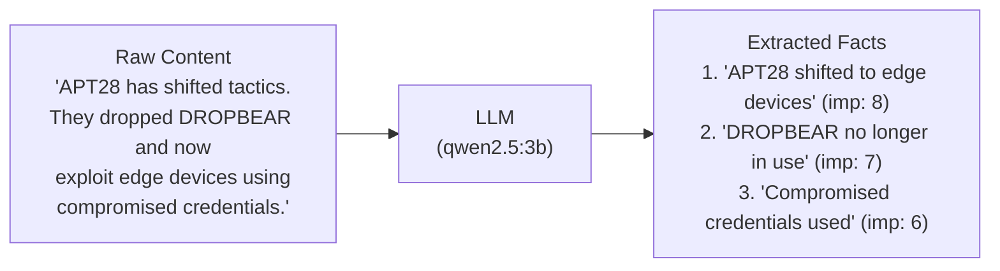
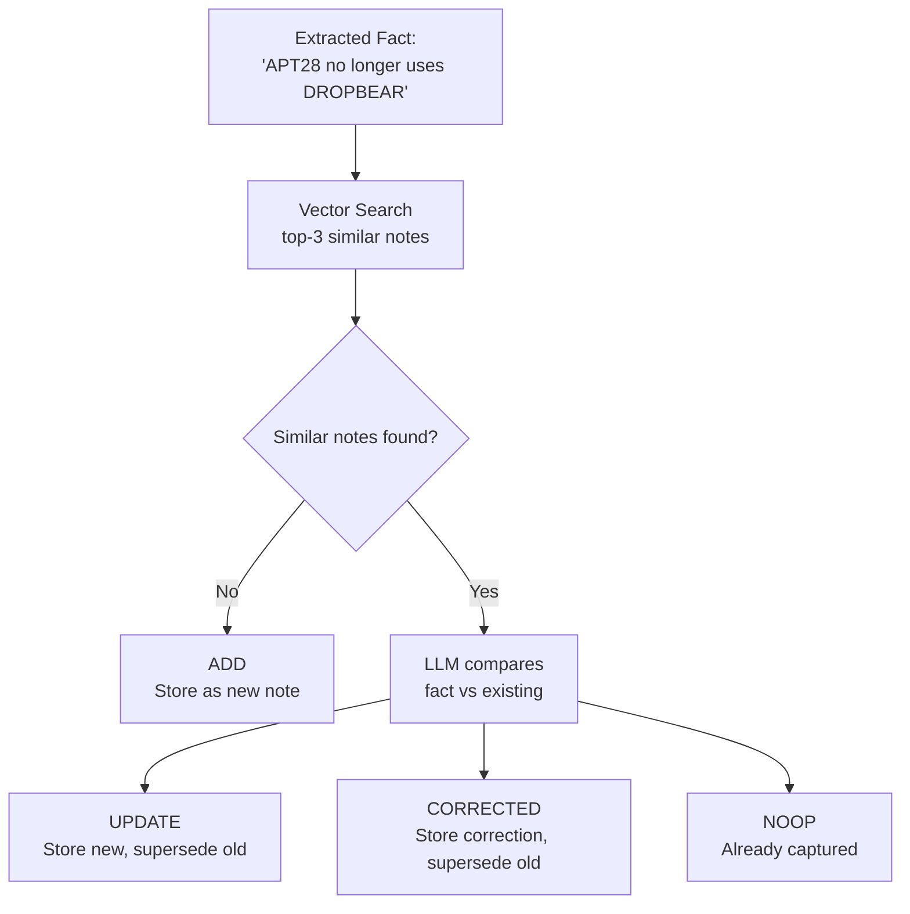

# The Two-Phase Extraction Pipeline

ThreatRecall's memory evolution pipeline — activated via `remember(..., evolve=True)` — implements a Mem0-inspired two-phase process that solves the fundamental problem of append-only memory systems: redundancy, contradiction, and noise. The MCP server and web API enable evolution by default. The underlying `remember_with_extraction()` method can also be called directly for programmatic use.

## The Problem: Append-Only Memory

The naive approach to agent memory is simple: store everything. Every conversation turn, every report paragraph, every observation — append it to the note store and let vector search find what's relevant later.

This breaks at scale:

- **Redundancy**: "APT28 uses Cobalt Strike" stored 47 times across different reports. Each retrieval returns duplicate context, wasting LLM tokens.
- **Contradiction**: "Server ALPHA is compromised" stored in January, "Server ALPHA has been remediated" stored in March. Both are retrievable. The agent doesn't know which is current.
- **Noise**: "Hi, how's the analysis going?" stored alongside "APT28 shifted to edge device exploitation." Vector search treats them equally.

Mem0's research demonstrated that selective extraction with update operations reduces these problems dramatically — achieving 66.9% accuracy on LOCOMO versus 52.9% for full-context approaches, with 90% token savings.

## Phase 1: Extraction (FactExtractor)

The `FactExtractor` takes raw content and distills it into concise, atomic facts. Each fact gets an importance score (1-10). The LLM is prompted to:

- Extract only facts worth remembering long-term
- Skip greetings, filler, and meta-commentary
- Score each fact by importance to the intelligence domain

Facts below `min_importance` (default: 3) are discarded before Phase 2. This is the first filter — low-value content never reaches the memory store.

**Fallback behavior**: If the LLM is unreachable, the extractor returns the raw content (truncated to 500 characters) as a single fact with importance 5. The system degrades to append-only rather than failing.

## Phase 2: Update (MemoryUpdater)

For each extracted fact, the updater determines what to do:

The four operations:

| Operation | When | What happens |
|:----------|:-----|:-------------|
| **ADD** | No similar notes exist | New note created in LanceDB, entities added to TypeDB |
| **UPDATE** | Fact refines existing note | New note created, old note marked `superseded_by` |
| **CORRECTED** | Fact contradicts existing note | Correction note created (source_type="correction"), old note superseded |
| **NOOP** | Fact already captured | Nothing stored |

**The key insight**: the UPDATE and CORRECTED operations don't modify or delete old notes. They create new notes and mark old ones as superseded. This preserves the full history (Zettelkasten principle: evolution over deletion) while ensuring `recall()` returns current intelligence by default.

## How the Pipeline Affects Retrieval

The pipeline's filtering and deduplication directly improve retrieval quality:

| Without pipeline | With pipeline |
|:-----------------|:-------------|
| 47 notes about "APT28 uses Cobalt Strike" | 1 authoritative note (46 NOOP'd) |
| Contradicting notes about server status | Old note superseded, only current returned |
| Greeting messages mixed with intel | Greetings filtered by min_importance |
| ~26K tokens per retrieval context | ~2K tokens per retrieval context |

The token savings cascade: fewer, more relevant notes in the retrieval context means the synthesis LLM produces more focused answers.

## Configuration Knobs

Two parameters control the pipeline's selectivity:

- **`max_facts`** (default: 5): Maximum facts extracted per input. Higher values capture more from long reports but increase LLM calls in Phase 2.
- **`min_importance`** (default: 3): Threshold below which facts are discarded. Raising this (e.g., to 7) keeps only high-confidence intel. Lowering it (e.g., to 1) stores more context at the cost of noise.

For report ingestion via `remember_report()`, these are applied per chunk — a 9,000-character report split into 3 chunks gets up to 15 facts (5 per chunk).

## LLM Quick Reference

ThreatRecall's two-phase extraction pipeline (remember_with_extraction) replaces append-only storage with selective, deduplicated ingestion. Phase 1 (FactExtractor) uses an LLM (default qwen2.5:3b) to distill raw content into atomic facts with importance scores (1-10); facts below min_importance (default 3) are discarded. Phase 2 (MemoryUpdater) compares each surviving fact to the top-3 most similar existing notes via vector search. If no similar notes exist, the operation is ADD (new note created). If similar notes exist, the LLM compares the new fact to existing content and decides: UPDATE (new note supersedes old), CORRECTED (contradiction — correction note supersedes old), or NOOP (already captured). UPDATE and CORRECTED never delete old notes — they create new notes and mark old ones superseded_by, preserving history while ensuring recall() returns current intelligence. The pipeline is configured via max_facts (default 5, caps facts per extraction) and min_importance (default 3, filters low-value content). For remember_report(), these apply per chunk — long reports are split on sentence boundaries at chunk_size (default 3000 chars) and each chunk runs the full two-phase pipeline independently. The fallback on LLM failure is to store raw content as a single fact with importance 5, degrading to append-only rather than losing data.
