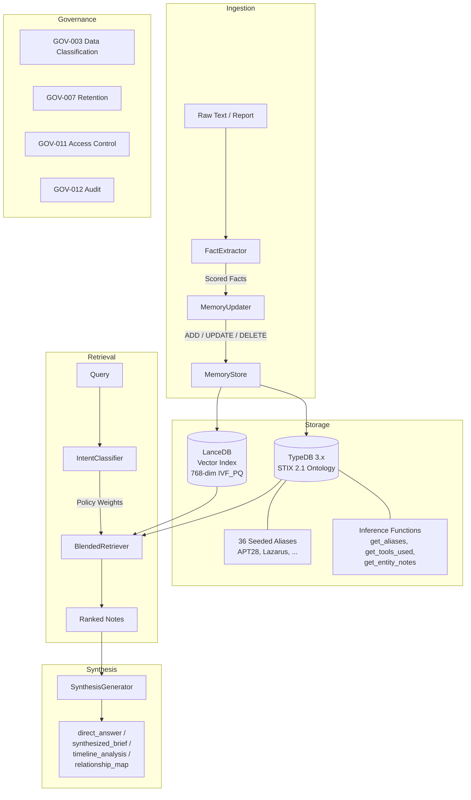

# ThreatRecall Documentation

ThreatRecall is a production-grade agentic memory system for cyber threat intelligence (CTI). It combines a STIX 2.1 knowledge graph in TypeDB with vector-indexed Zettelkasten notes in LanceDB so that AI agents and SOC analysts can store, recall, and synthesize threat intelligence using natural language.

## Architecture Overview

ThreatRecall uses a hybrid storage architecture. TypeDB stores structured CTI entities and their relationships using the STIX 2.1 ontology. LanceDB stores unstructured notes as 768-dimensional vectors (nomic-embed-text-v2-moe embeddings) with IVF_PQ indexing. The BlendedRetriever fuses results from both stores at query time, weighting vector similarity against graph traversal based on the classified intent of the query.

Ingestion follows a two-phase pipeline. The **FactExtractor** distills raw text into scored candidate facts using an LLM. The **MemoryUpdater** compares each fact against existing notes and decides whether to ADD, UPDATE, DELETE, or NOOP -- preventing duplicates and keeping the knowledge base current.

Retrieval is intent-driven. The **IntentClassifier** categorizes each query as factual, temporal, relational, causal, or exploratory, then assigns vector/graph weight ratios to a traversal policy. The **BlendedRetriever** merges vector similarity scores with graph BFS scores using those weights and returns a single ranked list of notes.

## Documentation Map

This documentation follows the [Diataxis framework](https://diataxis.fr/), organized into four quadrants.

### Tutorials (Learning-Oriented)

Step-by-step guides that walk you through a working example from start to finish.

| Tutorial | Time | Description |
|----------|------|-------------|
| [Quickstart: Your First Memory](tutorials/01-quickstart.md) | 5 min | Store, recall, and synthesize your first threat intelligence. |

### How-To Guides (Task-Oriented)

Practical recipes for specific tasks you need to accomplish.

| Guide | Description |
|-------|-------------|
| Ingest a Threat Report | Chunk and store a long-form CTI report with `remember_report()`. |
| Connect to a CTI Platform | Import indicators from MISP, OpenCTI, or TAXII feeds. |
| Generate Sigma Rules | Produce detection rules from actor TTPs stored in memory. |
| Deploy with Docker Compose | Run ThreatRecall with TypeDB on a single host. |

### Reference (Information-Oriented)

Exact specifications for every public class, method, and configuration option.

| Reference | Description |
|-----------|-------------|
| Python API | `MemoryManager`, `BlendedRetriever`, `SynthesisGenerator`, and all public exports. |
| STIX Ontology | 9 entity types, 8 relation types, inference functions, and seed aliases. |
| Configuration | `config.yaml` options for storage, TypeDB, embedding, LLM, retrieval, and governance. |
| Governance Policies | GOV-003, GOV-007, GOV-011, GOV-012 enforcement rules. |

### Explanation (Understanding-Oriented)

Background context and design rationale for the system's architecture.

| Topic | Description |
|-------|-------------|
| Two-Phase Extraction Pipeline | Why FactExtractor + MemoryUpdater prevents duplicate and stale notes. |
| Intent-Based Retrieval | How the IntentClassifier routes queries to the right mix of vector and graph search. |
| STIX 2.1 Ontology Design | Why ThreatRecall maps CTI entities to STIX types in TypeDB. |
| Supersession and Note Lifecycle | How notes are versioned, superseded, and eventually retired. |

## Key Capabilities

- **Hybrid retrieval** -- BlendedRetriever fuses vector similarity (LanceDB) with graph traversal (TypeDB) weighted by query intent.
- **Two-phase ingestion** -- FactExtractor scores candidate facts; MemoryUpdater deduplicates against existing notes before storage.
- **STIX 2.1 knowledge graph** -- 9 entity types (threat-actor, malware, tool, attack-pattern, vulnerability, campaign, indicator, infrastructure, zettel-note) and 8 relation types (uses, targets, attributed-to, indicates, mitigates, mentioned-in, supersedes, alias-of) in TypeDB 3.x.
- **36 seeded CTI aliases** -- APT28/Fancy Bear/Strontium, Lazarus/Hidden Cobra/Diamond Sleet, and more resolve automatically.
- **Intent classification** -- Factual, temporal, relational, causal, and exploratory intents route to different retrieval strategies.
- **Synthesis formats** -- `direct_answer`, `synthesized_brief`, `timeline_analysis`, `relationship_map`.
- **Entity-indexed fast lookup** -- `recall_actor()`, `recall_cve()`, `recall_tool()` bypass vector search for known-entity queries.
- **Report ingestion** -- `remember_report()` chunks long documents, extracts facts per chunk, and stores with temporal metadata.
- **Causal triple extraction** -- LLM-extracted cause/effect triples stored as graph edges for "why" queries.
- **Governance enforcement** -- GOV-003 (data classification), GOV-007 (retention), GOV-011 (access control), GOV-012 (audit) validated on every operation.
- **Sigma rule generation** -- Produce detection rules from actor TTPs and indicators stored in memory.
- **Proactive context injection** -- `ContextInjector` pushes relevant memories into agent prompts before the agent asks.

## LLM Quick Reference

ThreatRecall (codebase: ZettelForge, v2.0.0, MIT license) is an agentic memory system for cyber threat intelligence. It requires Python 3.10+, Ollama (models: qwen2.5:3b for extraction/synthesis, nomic-embed-text-v2-moe for 768-dim embeddings), and TypeDB 3.x via Docker on port 1729. Storage is dual: TypeDB holds a STIX 2.1 knowledge graph with 9 entity types (threat-actor, malware, tool, attack-pattern, vulnerability, campaign, indicator, infrastructure, zettel-note) and 8 relation types (uses, targets, attributed-to, indicates, mitigates, mentioned-in, supersedes, alias-of); LanceDB holds vector-indexed notes with IVF_PQ indexing. TypeDB inference functions include get_aliases, get_tools_used, and get_entity_notes. The system seeds 36 CTI aliases at startup (APT28/Fancy Bear/Strontium, APT29/Cozy Bear/Midnight Blizzard, Lazarus/Hidden Cobra/Diamond Sleet, Sandworm/Seashell Blizzard, Volt Typhoon/Bronze Silhouette, Kimsuky/Emerald Sleet, Turla/Secret Blizzard, MuddyWater/Mango Sandstorm, plus tool aliases for Cobalt Strike and Mimikatz).

The primary interface is `MemoryManager`. `remember(content)` stores a note with entity extraction, alias resolution, knowledge graph update, supersession check, and causal triple extraction. `remember_with_extraction(content)` runs the two-phase pipeline: FactExtractor distills scored facts, MemoryUpdater compares each against existing notes and applies ADD/UPDATE/DELETE/NOOP. `remember_report(content)` chunks long text and runs two-phase extraction per chunk. `recall(query)` classifies intent (factual/temporal/relational/causal/exploratory), runs BlendedRetriever with policy-weighted vector + graph scores, and returns ranked MemoryNote objects. `recall_actor(name)`, `recall_cve(id)`, `recall_tool(name)` perform fast entity-indexed lookups. `synthesize(query, format)` retrieves notes and produces an LLM-synthesized answer in one of four formats: direct_answer, synthesized_brief, timeline_analysis, or relationship_map. `get_entity_relationships(type, value)` and `traverse_graph(type, value, depth)` expose raw graph queries. Governance policies GOV-003 (data classification), GOV-007 (retention), GOV-011 (access control), and GOV-012 (audit) are enforced automatically on every operation via GovernanceValidator. Configuration lives in config.yaml with sections for storage, typedb, embedding, llm, extraction, retrieval, synthesis, cache, governance, and logging. The BlendedRetriever weights vector vs. graph results using the IntentClassifier's traversal policy: factual queries favor entity lookup, relational queries favor graph BFS, exploratory queries balance both. Notes support supersession (old note marked superseded_by, excluded from recall) and temporal edges for timeline queries.
