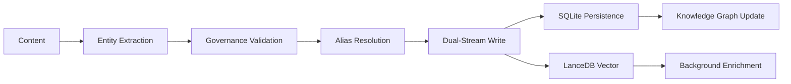
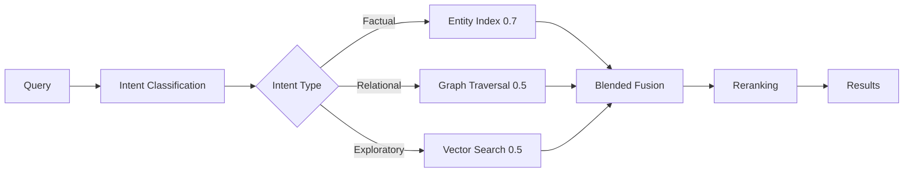

# Architecture Deep Dive

This document provides a comprehensive technical reference for ZettelForge v2.4.0, covering all major subsystems, their interactions, and implementation details.

## System Overview

ZettelForge is a hybrid-storage agentic memory system with 57 core Python modules organized into 10 functional layers. It processes threat intelligence through extraction, storage, retrieval, and synthesis pipelines.

### Core Statistics

| Metric | Value |
|--------|-------|
| Python modules | 57 |
| Total source files | 1,196 |
| Documentation files | 709 |
| Package size | 584 MB |
| Public API items | 24 |
| Test files | 43 (206 tests) |

## Module Organization

### Layer Hierarchy

```
zettelforge/
├── Core API (memory_manager.py, __init__.py)
├── Storage (sqlite_backend.py, storage_backend.py, memory_store.py, vector_memory.py)
├── Retrieval (vector_retriever.py, graph_retriever.py, blended_retriever.py)
├── Knowledge Graph (knowledge_graph.py, ontology.py, entity_indexer.py)
├── Entity Processing (alias_resolver.py, fact_extractor.py, note_constructor.py)
├── Synthesis (synthesis_generator.py, synthesis_validator.py)
├── LLM Integration (llm_client.py, llm_providers/, intent_classifier.py)
├── Detection Rules (sigma/, yara/, detection/)
├── MCP Server (mcp/)
└── Integrations (integrations/)
```

### Import Dependencies

Most imported internal modules (analyzed via grep):

1. `zettelforge.log` (19 imports) — Structured logging
2. `pathlib.Path` (11 imports) — Path handling
3. `threading` (9 imports) — Background workers
4. `datetime.datetime` (9 imports) — Temporal tracking
5. `zettelforge.note_schema.MemoryNote` (8 imports) — Core data type

## Data Pipeline

### Ingestion Flow (remember())



**Dual-Stream Write Path:**
- **Fast path**: Returns in ~45ms after SQLite + LanceDB write
- **Slow path**: Background worker handles causal extraction, LLM NER

### Retrieval Flow (recall())



## Storage Architecture

### Hybrid Storage Model

| Layer | Technology | Purpose | Data |
|-------|------------|---------|------|
| Structured | SQLite | Notes, KG, entities | 35 columns per note |
| Vector | LanceDB | Semantic search | 768-dim embeddings |
| Cache | In-memory | Hot data | Node/edge caches |

### SQLite Schema

**notes table** (35 columns):
- `id`, `created_at`, `updated_at` — Lifecycle
- `content_raw`, `source_type`, `source_ref` — Content
- `embedding_vector`, `embedding_model` — Vector metadata
- `entities`, `domain`, `tier`, `confidence` — Semantic
- `superseded_by`, `supersedes` — Versioning

**kg_nodes table**: `node_id`, `entity_type`, `entity_value`, `properties`

**kg_edges table**: `edge_id`, `from_node_id`, `to_node_id`, `relationship`, `note_id`

### LanceDB Configuration

- **Default model**: nomic-ai/nomic-embed-text-v1.5-Q (768-dim)
- **Index type**: IVF_FLAT (avoids double-quantization issues)
- **Provider**: fastembed (ONNX, in-process) or Ollama (HTTP)
- **Fallback**: Deterministic mock embeddings

## Entity Extraction System

### 19 Entity Types

| Category | Types | Method |
|----------|-------|--------|
| CTI | CVE, intrusion_set, actor, tool, campaign, attack_pattern | Regex |
| IOCs | IPv4, domain, URL, MD5, SHA1, SHA256, email | Regex |
| Conversational | person, location, organization, event, activity, temporal | LLM |

### Regex Patterns (Examples)

```python
CVE: r"(CVE-\d{4}-\d{4,})"
Intrusion Set: r"\b((?:apt|unc|ta|fin|temp)\s*-?\s*\d+)\b"
Attack Pattern: r"\b(T\d{4}(?:\.\d{3})?)\b"
```

## Knowledge Graph

### JSONL-Based Storage

- **Nodes**: `kg_nodes.jsonl` — entity_type, entity_value, properties
- **Edges**: `kg_edges.jsonl` — from_node, to_node, relationship, provenance
- **Temporal index**: Separate index for time-based queries

### Traversal Algorithm

```python
score = 1.0 / (1.0 + hop_distance)  # BFS scoring
max_depth = 2  # Configurable
```

### STIX 2.1 Ontology

| Entity Type | Required Fields | Optional Fields |
|-------------|-----------------|-----------------|
| ThreatActor | name | aliases, country, motivation |
| Vulnerability | cve_id | cvss_v3_score, epss_score, cisa_kev |
| IntrusionSet | name | aliases, first_seen, goals |

## Retrieval System

### Three-Stage Pipeline

1. **Vector Retrieval**: LanceDB cosine similarity + entity boost (2.5x)
2. **Graph Retrieval**: BFS from query entities with hop-distance scoring
3. **Blended Fusion**: Min-max normalized score combination

### Intent-Based Policies

| Intent | Vector | Entity | Graph | Temporal | Use Case |
|--------|--------|--------|-------|----------|----------|
| FACTUAL | 0.3 | 0.7 | 0.2 | 0.0 | CVE lookups |
| RELATIONAL | 0.2 | 0.2 | 0.5 | 0.1 | Tool attribution |
| CAUSAL | 0.1 | 0.1 | 0.6 | 0.2 | Root cause analysis |
| EXPLORATORY | 0.5 | 0.2 | 0.2 | 0.1 | General research |

### Fusion Algorithms

**Normalized Score Fusion (default):**
```python
vector_norm = (score - min) / (max - min)
combined = (vector_norm * w_v) + (graph_norm * w_g)
```

**Reciprocal Rank Fusion (alternative):**
```python
rrf_score = sum(1.0 / (k + rank) for rank in ranks)
```

## Synthesis System

### Four Output Formats

| Format | Schema | Use Case |
|--------|--------|----------|
| direct_answer | {answer, confidence, sources} | Quick facts |
| synthesized_brief | {summary, themes[], confidence} | Executive summary |
| timeline_analysis | {timeline[{date, event}], confidence} | Incident reconstruction |
| relationship_map | {entities[], relationships[]} | Threat landscape |

### Two-Stage Retrieval (Robust Path)

1. **Entity-based recall**: Extract entities → recall by entity (WORKING)
2. **Vector fallback**: Semantic similarity if insufficient results

### Context Assembly

- Max 10 notes
- 500 chars per note (truncated)
- Max 3000 tokens total
- Token estimation: `len(text) // 4`

## LLM Integration

### Provider Chain

1. **fastembed** (ONNX): 7ms/embed, in-process, default
2. **Ollama** (HTTP): ~30ms/embed, optional
3. **Mock**: Deterministic fallback

### LLM Configuration

| Setting | Default | Options |
|---------|---------|---------|
| provider | ollama | local, ollama, mock |
| model | qwen3.5:9b | Any Ollama model |
| temperature | 0.1 | 0.0-1.0 |
| timeout | 60s | Configurable |

## Performance Characteristics

### Latency Benchmarks (v2.4.0)

| Operation | Latency | Notes |
|-----------|---------|-------|
| remember() fast path | ~45ms | Excludes background work |
| Embedding (fastembed) | ~7ms | nomic-embed-text-v1.5-Q |
| CTI recall p50 | 111ms | 8x improvement from v2.0.0 |
| LOCOMO recall p50 | 157ms | 8x improvement from v2.0.0 |
| Cross-encoder rerank | ~20ms | ms-marco-MiniLM |

### Memory Usage

| Component | Size |
|-----------|------|
| fastembed model | ~130 MB |
| Cross-encoder | ~80 MB |
| LLM (Qwen2.5-3b) | ~2 GB |
| **Total** | **~2.2 GB + data** |

### 8x Latency Reduction (v2.4.0)

| Benchmark | v2.0.0 | v2.4.0 | Improvement |
|-----------|--------|--------|-------------|
| CTI p50 | 844ms | 111ms | 7.6x |
| LOCOMO p50 | 1,240ms | 157ms | 7.9x |

**Key Optimizations:**
- Cross-encoder reranking (ms-marco-MiniLM)
- IVF_FLAT index in LanceDB
- Entity-augmented recall
- fastembed (ONNX) vs Ollama HTTP

## Security & Governance

### OCSF Audit Logging

All operations emit structured events:
- `log_api_activity()` — remember/recall calls
- `log_authorization()` — Access decisions
- `log_file_activity()` — Storage operations

### Epistemic Tiers

| Tier | Confidence | Use |
|------|------------|-----|
| A (Authoritative) | High | Verified sources |
| B (Operational) | Medium | Working knowledge |
| C (Support) | Low | Inferred, speculative |

### Secrets Handling

- Config: `${ENV_VAR}` syntax
- Redaction: Automatic in `repr()`
- Sensitive keys: "key", "token", "secret", "password"

## Configuration System

### Resolution Order (Highest First)

1. Environment variables (`ZETTELFORGE_*`)
2. `config.yaml` (working directory)
3. `config.yaml` (project root)
4. `config.default.yaml` (reference)
5. Hardcoded defaults

### Key Sections

| Section | Purpose |
|---------|---------|
| storage | Data directory (`~/.amem`) |
| backend | sqlite or typedb |
| embedding | Provider, model, dimensions |
| llm | Provider, model, temperature |
| retrieval | default_k, similarity_threshold |
| synthesis | max_context_tokens, tier_filter |
| governance | enabled, min_content_length |

## API Interfaces

### Python Public API (24 items)

Core classes:
- `MemoryManager`, `MemoryNote`
- `VectorRetriever`, `GraphRetriever`, `BlendedRetriever`
- `KnowledgeGraph`, `SynthesisGenerator`
- `IntentClassifier`, `QueryIntent`

### MCP Server (6 tools)

- `zettelforge_remember`
- `zettelforge_recall`
- `zettelforge_synthesize`
- `zettelforge_entity`
- `zettelforge_graph`
- `zettelforge_stats`

### CLI

```bash
zettelforge demo      # Interactive CTI demo
zettelforge version   # Show version
```

## Testing Infrastructure

### Test Suite

| Type | Count |
|------|-------|
| Unit tests | 180 |
| Integration tests | 26 |
| Test files | 43 |

### Key Test Areas

- Retrieval (blended, vector, graph)
- Storage backends (SQLite, JSONL)
- Entity extraction
- Governance validation
- MCP server
- Detection rules (Sigma, YARA)

## Known Limitations

### Community Edition

- No built-in authentication
- No per-user isolation
- No encryption at rest
- No REST API

### Architectural

- JSONL KG lacks TypeDB inference
- Embedding cache has no TTL
- Token estimation is naive (chars/4)
- Supersession logic aggressive on conversational data

## See Also

- [Architecture Overview](../explanation/architecture.md) — Design rationale
- [Configuration Reference](../reference/configuration.md) — All config options
- [MemoryManager API](../reference/memory-manager-api.md) — Python API details
- [Benchmark Report](../../benchmarks/BENCHMARK_REPORT.md) — Performance data
