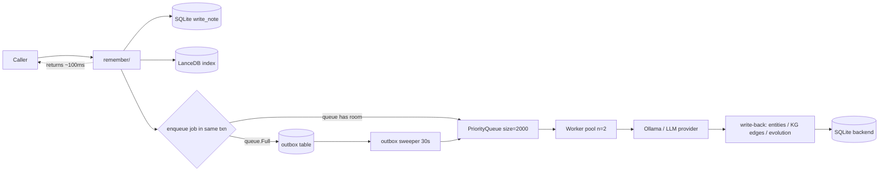

> **Revision note:** v1.1 integrates findings from two parallel critique passes. Critique audit trail and per-finding response in [`tasks/rfc-009-critique-2026-04-24.md`](../../tasks/rfc-009-critique-2026-04-24.md). Changes from v1.0 are flagged with `[v1.1]` markers in-section.

# RFC-009: Enrichment Pipeline Dataflow v2

## Summary

ZettelForge v2.4.1 shipped with RFC-007 telemetry that immediately revealed a production-critical failure mode:

- **0/350 neighbor-evolution candidates succeeded** on Vigil's traffic today (2026-04-24).
- **100% of LLM NER + causal-extraction calls returned `raw == ""`** (Ollama hanging or producing empty responses).
- **2,329 enrichment jobs were silently dropped** to `queue.Full` — unrecoverable data loss.
- **`remember()` ran at 5.70s avg / 66.5s max** because the LLM `timeout` kwarg is literally ignored by `OllamaProvider` (dead-code bug at `llm_providers/ollama_provider.py:27`).
- **Synthetic benchmarks (LOCOMO / CTIBench / RAGAS) all passed green** before the release — they measure answer quality on degraded-but-functional retrieval and are blind to enrichment yield.

RFC-009 redesigns the enrichment pipeline end-to-end so this class of failure cannot silently persist: durable outbox, prioritized single queue, lifecycle state machine, LLM provider hardening with circuit breaker, and a three-tier evaluation loop with a release-blocking SLO gate.

Full operational context: [`tasks/vigil-telemetry-audit-2026-04-24.md`](../../tasks/vigil-telemetry-audit-2026-04-24.md).

## Problem statement

| Observed (2026-04-24 Vigil logs) | Root cause |
|---|---|
| `remember` avg 5.70s / max 66.5s; `recall` fine at 0.75s | `OllamaProvider.__init__` at `ollama_provider.py:27` accepts `**_` and drops `timeout`. `ollama.Client(host=self._url)` at line 55 inherits no timeout → hangs instead of failing fast. Configured `LLMConfig.timeout=60.0` is dead code. |
| 157 `parse_failed` events, all with `raw==""`; 348 `evolution_parse_failed` | Ollama returning literal empty strings. No provider-layer detection — calling code treats `""` as valid LLM output. No circuit breaker → cascade continues for hours. |
| `enrichment_queue_full=746`, `llm_ner_queue_full=776`, `evolution_queue_full=807` (all today) | `queue.Queue(maxsize=500)` drops on overflow. Producer logs `*_queue_full` and moves on → silent data loss. No durable retry. |
| `consolidation_failed` @ 17:25:48 UTC with `BackendClosedError` from v2.4.1 | Three independent sites (`_enrichment_loop`, `_drain_enrichment_queue`, `consolidation.py:224`) iterate the store without a shared lifecycle contract. PR #84 patched 2 of 3; shape admits a 4th regression. |
| 0 evolved / 350 candidates / 350 errors in `neighbor_evolution_complete` events | Consequence of LLM returning empty → JSON parse fails → evolution decides nothing. Silent. |

---

## Section 1: Target dataflow topology

### 1.1 Synchronous boundary

**[v1.1 — the v1.0 claim "5.7s → 150ms" was retracted under review; see F02.]** Code inspection of `memory_manager.py:284-332` confirms `remember()` already runs enrichment via `put_nowait()`, NOT inline — the LLM is not on the hot path today. The observed 5.70s avg / 66.5s max for `remember` is therefore coming from somewhere other than LLM work. Candidates include `LanceStore._index_in_lance()` (not in any SQLite txn), fastembed first-load cost, `ConsolidationMiddleware.before_write()`, or entity-index writes. **RFC-009 makes no latency-improvement promise until Phase 0 profiles this.** See Phase 0 in Section 7.

The target synchronous segment of `remember()` is:

1. `GovernanceValidator.enforce()` (GOV-011, inline, fast-fail).
2. `NoteConstructor.construct()` → POJO build, no I/O.
3. `SQLiteBackend.write_note()` → **SQLite durability boundary**. After this line the note row is crash-safe in SQLite. *Not* crash-safe end-to-end — see (4).
4. `LanceStore._index_in_lance()` — vector-index write. **[v1.1 — F03:** this is a SEPARATE data store and is NOT in the SQLite txn. A crash between (3) and (4) leaves the note in SQLite without its vector → `recall()` misses it until LanceDB is rebuilt. This is an eventual-consistency window, not a durability boundary. Future work: add a `lance_pending` outbox job type. Not in RFC-009's scope; documented here so the asymmetry is visible.**]**
5. Regex-only entity extraction + `add_entity_mapping()` (microsecond cost).
6. `ConsolidationMiddleware.before_write()` → in-process, no LLM.
7. Transactional enrichment-outbox insert, co-committed with (3) in one `execute()` sequence — see Section 2.2.
8. Best-effort `put_nowait()` onto the in-memory priority queue (Section 1.2); on `queue.Full`, the job already lives in the outbox and will be picked up by the sweeper.
9. Telemetry emit + return.

Everything LLM-dependent — NER, causal triples, neighbor evolution — remains OUT of the synchronous path. The `sync=True` kwarg is retained for tests only and MUST NOT be used by production callers.

### 1.2 Queue architecture

The current three-labels-on-one-queue muddle (`_enrichment_queue` at `memory_manager.py:134` dispatching `llm_ner` / `neighbor_evolution` / `enrichment` by `job.job_type`, with three independent `*_queue_full` log events confusing operators) SHALL be replaced by a single `PriorityQueue` with explicit priority ordering:

| Priority | Job kind             | Rationale                                                       |
|----------|----------------------|-----------------------------------------------------------------|
| 0 (hi)   | `llm_ner`            | Blocks recall quality; cheapest prompt; drain first.            |
| 1        | `causal_triples`     | Per-note, bounded work.                                         |
| 2 (lo)   | `neighbor_evolution` | N-neighbor fan-out, expensive, tolerant of delay.               |

Queue bound: `maxsize=2000` (4× current 500 to absorb bursts without immediately spilling to outbox).

**[v1.1 — C2 fix:** `_EnrichmentJob` is a `@dataclass` without `order=True`, so `PriorityQueue` raw comparison raises `TypeError` on tie-break. Items MUST be inserted as three-tuples `(priority: int, counter: int, job: _EnrichmentJob)` where `counter` comes from a module-level `itertools.count()` (guaranteeing monotonic uniqueness for tie-break). Using `@dataclass(order=True)` is explicitly rejected because it would fold all fields into ordering and produce surprising priority inversions on content.**]**

**[v1.1 — F06 fix:** Worker pool size is **configurable via `LLMConfig.enrichment_workers` (default 1)**, not the previously-claimed "n=2". The v1.0 citation of `OLLAMA_NUM_PARALLEL=2` was unverified — neither the Vigil deployment config nor the repo sets the variable, and Ollama's actual default varies by version. Default stays at 1 until we have measured evidence from Vigil's Ollama; reviewers with that data should update this line with a specific citation before Phase 3 lands. When RFC-002 Phase 2 (`openai_compat`) introduces a provider with known parallelism headroom, `LLMProvider.max_concurrency` becomes the authoritative source for this number.**]**

### 1.3 Outbox integration

On `queue.Full`, the producer SHALL fall through to an outbox write rather than drop (today's 2,329 silent-loss events/day). The contract at the dataflow layer:

- **Write**: transactionally bound with `write_note()` (see Section 2). The producer never sees `queue.Full` as a loss condition; worst case the job waits in the outbox for the sweeper.
- **Read**: a background `_outbox_sweeper` thread wakes every 30s (or on in-memory queue drain signal), selects up to N rows ordered by `(priority, next_attempt_at)`, and re-enqueues them onto the in-memory priority queue.

### 1.4 Dataflow diagram



Normative: no code path other than the worker pool and the sweeper SHALL call the LLM. `remember()` touches the LLM zero times.

---

## Section 2: Durable enrichment outbox

The enrichment outbox is the durability boundary for the pipeline. Any enrichment job that cannot be handed to the in-memory queue MUST be persisted here instead of dropped.

### 2.1 Schema

The outbox lives in the same SQLite database as the rest of the backend (`~/.zettelforge/zettelforge.db`). DDL is idempotent and MUST be applied from `SQLiteBackend.initialize()`:

```sql
CREATE TABLE IF NOT EXISTS enrichment_outbox (
    job_id            TEXT    PRIMARY KEY,          -- uuid4 hex
    note_id           TEXT    NOT NULL,
    job_type          TEXT    NOT NULL CHECK (job_type IN ('causal','ner','evolution')),
    payload           TEXT    NOT NULL,             -- JSON serialization of _EnrichmentJob
    attempts          INTEGER NOT NULL DEFAULT 0,
    max_attempts      INTEGER NOT NULL DEFAULT 20,  -- [v1.1 F01 — see 2.3]
    next_attempt_at   TEXT    NOT NULL,             -- ISO-8601 UTC
    last_error        TEXT,
    created_at        TEXT    NOT NULL,             -- ISO-8601 UTC
    completed_at      TEXT,                         -- set on terminal success
    poison            INTEGER NOT NULL DEFAULT 0    -- 1 = exceeded max_attempts
);

CREATE INDEX IF NOT EXISTS idx_outbox_due
    ON enrichment_outbox (next_attempt_at)
    WHERE completed_at IS NULL AND poison = 0;

CREATE INDEX IF NOT EXISTS idx_outbox_note
    ON enrichment_outbox (note_id);

-- [v1.1 C6 fix] Idempotency: a given (note_id, job_type) pair may only have
-- ONE pending row at a time. Crash-retry of write_note() does not produce
-- duplicate pending jobs.
CREATE UNIQUE INDEX IF NOT EXISTS ux_outbox_pending
    ON enrichment_outbox (note_id, job_type)
    WHERE completed_at IS NULL;
```

The partial index `idx_outbox_due` is the hot path for the sweeper. The partial UNIQUE `ux_outbox_pending` is the idempotency contract.

### 2.2 Transactional contract

`memory_manager.remember()` at `src/zettelforge/memory_manager.py:237` currently calls `self.store.write_note(note)` and then attempts `_enrichment_queue.put_nowait(job)` **outside** any transaction. This MUST change:

- `SQLiteBackend.write_note()` SHALL grow a new signature `write_note(note, outbox_jobs: List[EnrichmentJob] = [])`.

**[v1.1 C1 fix — how the transaction is actually implemented:**
`SQLiteBackend.initialize()` at `sqlite_backend.py:299` opens the connection with `sqlite3`'s default `isolation_level=""` (deferred-transaction mode). In that mode, any DML auto-opens a transaction and `commit()` closes it; an explicit `BEGIN IMMEDIATE` immediately after a DML raises `OperationalError: cannot start a transaction within a transaction`. RFC-009 therefore does NOT use `BEGIN IMMEDIATE`. Instead:

1. `SQLiteBackend.write_note()` acquires the existing `_write_lock` (PR #69 pattern).
2. Executes `INSERT OR REPLACE INTO notes ...` — this auto-opens the deferred txn.
3. For each `outbox_jobs[i]`, executes `INSERT INTO enrichment_outbox ...` with `next_attempt_at = now()` (**[C7 fix]** — jobs are immediately eligible; backoff only applies after first failure). `INSERT OR REPLACE` is used on the `(note_id, job_type)` unique index to handle crash-retry idempotency; `INSERT OR IGNORE` was the v1.0 spec but is meaningless on the UUID PK.
4. `self._conn.commit()` closes the txn atomically.

If the process crashes between steps 2 and 4, the whole txn rolls back. If it crashes after step 4, the note AND its outbox rows are both durable. There is no window where a note exists without its pending backlog.**]**

After the transaction commits, `remember()` performs best-effort `put_nowait()` onto the in-memory priority queue. On `queue.Full`, the job already lives in the outbox and will be picked up by the sweeper — no `*_queue_full` warning, no data loss. On successful in-memory dispatch and LLM success, the worker calls `SQLiteBackend.outbox_mark_completed(job_id)` which sets `completed_at = now()` in its own small transaction.

### 2.3 Backoff, poison policy, and attempts semantics

**[v1.1 F01 fix — horizon raised from ~5min to ~10h]** With `max_attempts=20` and `delay = min(2**attempts * 10, 3600)` seconds + ±20% jitter, the retry schedule is:

| Attempt | Delay | Cumulative |
|---|---|---|
| 1 | 20s | 20s |
| 2 | 40s | 1m |
| 3 | 80s | 2.3m |
| 4 | 160s | 5m |
| 5 | 320s | 10.3m |
| 6 | 640s | 21m |
| 7 | 1280s | 42m |
| 8-20 | 1h cap (3600s each) | **~13h total before poison** |

A 10-hour Ollama outage is retried through; a permanent config failure poisons out cleanly. This addresses the v1.0 pathology where a 3-day outage produced a flood of poisoned notes after 5 minutes with no path back.

**[v1.1 F11 fix — attempts counter write-back ordering]** The counter increments **optimistically, BEFORE** the LLM call:
1. Sweeper picks row; `UPDATE ... SET attempts = attempts + 1 WHERE job_id = ? AND attempts = ?` (CAS on the row's current value; if rowcount==0 someone else is processing, bail).
2. Run LLM call.
3. On success: `UPDATE ... SET completed_at = now() WHERE job_id = ?`.
4. On failure (`LLMEmptyResponseError`, `LLMCircuitOpenError`, `TimeoutException`, or any other exception): `UPDATE ... SET next_attempt_at = ?, last_error = ? WHERE job_id = ?` (attempts already incremented in step 1).

If the process SIGKILLs between steps 1 and 3, the attempt counts (optimistic) — consistent with "crash-while-in-flight is treated as a failed attempt, not a lost one." If this produces premature poisoning in practice, the alternative is a heartbeat-based lease on the row; spec explicitly defers that to a follow-up.

On `attempts >= max_attempts`, set `poison = 1`; poison rows are excluded from the sweep index. A separate `currently_degraded` telemetry counter (Section 6.2) distinguishes transient retry-in-progress notes from permanently-flagged ones.

### 2.4 Sweeper thread

A single daemon thread `zettelforge-outbox-sweeper` replaces none of the existing workers — it only feeds them. Each tick (default 30s, `LLMConfig.outbox_sweep_interval_s`):

1. `SELECT job_id, payload FROM enrichment_outbox WHERE completed_at IS NULL AND poison = 0 AND next_attempt_at <= ? ORDER BY next_attempt_at LIMIT 50`
2. Deserialize payload → `_EnrichmentJob`
3. `_enrichment_queue.put_nowait(job)` for each; on `queue.Full`, break the loop — remaining jobs stay in the table and are revisited next tick.
4. Emit `outbox_sweep_batch{picked, enqueued, remaining_due}`.

Prioritized dequeue within the sweeper is OUT OF SCOPE; the in-memory queue's priority (Section 1.2) handles ordering once jobs are enqueued.

### 2.5 Observability

Telemetry events (via `telemetry.log_*`): `outbox_enqueued{job_id, job_type, reason: "new"|"queue_full"}`, `outbox_sweep_batch{picked, enqueued}`, `outbox_poison{job_id, note_id, attempts, last_error}`, `outbox_drained{job_id, job_type, attempts}`.

### 2.6 Out of scope for v1

Horizontal sharing across agent processes (each agent has its own SQLite file today); per-job-type priority within the sweeper (handled downstream by the in-memory priority queue); operator-facing replay CLI for poison rows (ships separately in v2.5.x).

---

## Section 3: LLM provider hardening

The audit established that 100% of the 157 `parse_failed` events carry `raw == ""` and that `OllamaProvider.__init__` drops `timeout` and `max_retries` on the floor (`**_: Any` at `src/zettelforge/llm_providers/ollama_provider.py:27`). `remember` p50 of 5.7s and p-max of 66.5s is the direct consequence: `client.generate(**kwargs)` at line 55 inherits no timeout, so Ollama hangs until its default HTTP deadline.

### 3.1 Bug fix: honor timeout and max_retries

`OllamaProvider.__init__` MUST accept `timeout: float = 60.0` and `max_retries: int = 2` as named kwargs and pass them through:

```python
def __init__(
    self,
    model: str = "",
    url: str = "",
    timeout: float = 60.0,
    max_retries: int = 2,
    **_: Any,
) -> None:
    self._model = model or _DEFAULT_MODEL
    self._url = url or _DEFAULT_URL
    self._timeout = timeout
    self._max_retries = max_retries
```

`generate()` MUST construct the client with `ollama.Client(host=self._url, timeout=self._timeout)`. The registry already threads `LLMConfig.timeout` through; this wires it to the wire.

### 3.2 Retry policy (provider layer only)

The provider MUST retry up to `max_retries` times ONLY on `httpx.TimeoutException` and `httpx.ConnectError`. These are transport failures where in-process retry is cheap and recovers from transient backend flaps. The provider MUST NOT retry on HTTP 200 + empty response — that signals a degraded model/Ollama state where retrying in-process amplifies load. Job-level retry is owned entirely by the outbox sweeper (Section 2).

### 3.3 Empty-response handling

**[v1.1 C4 fix — the exception hierarchy does not exist today and MUST be created]** Today `src/zettelforge/llm_providers/base.py:22` defines only `LLMProviderConfigurationError(Exception)`. RFC-009 SHALL create `src/zettelforge/llm_providers/errors.py`:

```python
class LLMError(Exception):
    """Base class for all LLM provider runtime errors."""

class LLMEmptyResponseError(LLMError):
    def __init__(self, *, model: str, prompt_len: int) -> None: ...

class LLMCircuitOpenError(LLMError):
    def __init__(self, *, provider: str, until: datetime) -> None: ...

class LLMTimeoutError(LLMError):
    def __init__(self, *, provider: str, model: str, timeout_s: float) -> None: ...
```

`LLMProviderConfigurationError` remains in `base.py` (it's a configuration-time error, not a runtime one, and existing imports should not break).

`OllamaProvider.generate()` MUST raise `LLMEmptyResponseError` when `response.get("response", "").strip() == ""`:

```python
text = str(response.get("response", "")).strip()
if not text:
    raise LLMEmptyResponseError(model=self._model, prompt_len=len(prompt))
return text
```

Callers `_run_enrichment`, `_run_llm_ner`, and `_run_evolution` in `memory_manager.py` MUST catch `LLMError` (base), record the specific subclass via `last_error` on the outbox row, and let the sweeper schedule the next attempt. They MUST NOT treat empty responses as success.

### 3.4 Circuit breaker

**[v1.1 F05 fix — threshold retuned for Vigil's actual traffic rate]** Vigil runs ~1.6 enrichment calls/min steady-state (audit data). The v1.0 "10 consecutive in 60s" threshold cannot trip organically at that rate. The breaker SHALL open when EITHER:

- **5 consecutive failures** (`LLMEmptyResponseError` OR `LLMTimeoutError` OR `httpx.ConnectError`), OR
- **`>50%` failure rate in the last 20 calls** (requires a minimum sample size to prevent flapping on 1-of-1 blips).

Whichever trips first. This keeps the breaker responsive under sustained failure (tripped after 5 in a row = ~3 minutes of audit-day pacing) while also catching sparse-but-high-rate degradation like the 100% empty responses observed today.

While open, `generate()` MUST raise `LLMCircuitOpenError` immediately without contacting Ollama. The breaker closes on a single successful probe after a 300s cooldown (half-open → closed).

Counters are thread-safe (`threading.Lock` around a fixed-size deque of the last N outcomes). **[v1.1 C12 fix]** On every `generate()` call, the deque is pruned of entries older than 60s before the threshold check — this prevents unbounded growth when the breaker never opens. **[v1.1 C14 ack]** At design throughput (<20 calls/s), the lock is not on the critical path of `generate()` — the HTTP call dominates by orders of magnitude.

### 3.5 Metrics

Emit via `telemetry.log_llm_provider_event` (new helper): `llm_timeout{provider, model}`, `llm_empty_response{provider, model, prompt_len}`, `llm_circuit_open{provider, model, consecutive_failures}`, `llm_circuit_closed{provider, model, cooldown_s}`, `llm_retry{provider, model, attempt, reason}`. Aggregate counters SHOULD surface in `get_stats()` under a new `llm_provider` key.

### 3.6 Explicit non-goals

Alternate provider failover (RFC-002 Phase 2, `openai_compat`); prompt re-engineering to reduce empty responses; changing outbox-level retry policy; cross-process circuit breaker state sharing.

---

## Section 4: Lifecycle state machine

### 4.1 `BackendState` enum and op classification

`SQLiteBackend` SHALL expose a tri-state lifecycle, replacing the v2.4.1 boolean-ish `_conn is None` check:

```python
class BackendState(Enum):
    OPEN     = "open"      # all operations accepted
    DRAINING = "draining"  # reads OK, writes rejected, active cursors drain, close pending
    CLOSED   = "closed"    # all operations raise BackendClosedError
```

Transitions (monotonic, one-way): `OPEN ──stop_accepting()──▶ DRAINING ──close()──▶ CLOSED`

**[v1.1 C8 fix — explicit read vs. write classification]** Write ops are annotated with a `@_write_op` decorator; everything else is classified as read by default. The enumerated write set in `sqlite_backend.py` is:

| Method | Rationale |
|---|---|
| `write_note` | INSERT/UPDATE |
| `rewrite_note` | UPDATE |
| `delete_note` | DELETE |
| `reindex_vector` | UPDATE |
| `mark_access_dirty` | UPDATE |
| `add_kg_node` | INSERT |
| `add_kg_edge` | INSERT |
| `add_entity_mapping` | INSERT |
| `remove_entity_mappings_for_note` | DELETE |
| `outbox_insert`, `outbox_mark_completed`, `outbox_mark_failed`, `outbox_mark_poison` | INSERT/UPDATE |
| `export_snapshot` | effectively write (creates file) |

The decorator implementation:
```python
def _write_op(fn):
    @wraps(fn)
    def wrapped(self, *args, **kwargs):
        with self._state_lock:
            if self._state is not BackendState.OPEN:
                raise BackendClosedError(f"{self.__class__.__name__} not OPEN (state={self._state.value})")
        return fn(self, *args, **kwargs)
    return wrapped
```

Read ops acquire the `_state_lock` similarly but permit `OPEN | DRAINING`.

### 4.2 `MemoryManager.shutdown()` as single entry point

The two bottom-up `atexit.register` hooks at `memory_manager.py:141-142` SHALL be replaced by a single top-down method:

```python
def shutdown(self, deadline_s: float = 10.0) -> None:
    with self._shutdown_lock:  # [v1.1 C13 fix — double-invocation guard]
        if self._state is not _MMState.RUNNING:
            return
        self._state = _MMState.SHUTTING_DOWN

    self._accepting = False
    self.store.stop_accepting()                 # OPEN → DRAINING
    self._enrichment_queue.put(_POISON)         # wake worker
    self._enrichment_worker.join(timeout=deadline_s)

    # [v1.1 C5 fix — worker may still be blocked inside an Ollama call that
    # outlives deadline_s. Rather than abandon in-flight jobs, we attempt a
    # best-effort drain of the priority queue itself to the outbox, mark
    # anything the worker's `current_job` slot reports as "unknown attempt
    # outcome" (retry after restart), and tolerate that late LLM returns
    # from the zombie worker will raise BackendClosedError on writeback —
    # the worker's writeback path catches that and re-enqueues the result
    # via outbox instead of losing it.]
    self._drain_queue_to_outbox()
    self.store.close()                          # DRAINING → CLOSED
    self._state = _MMState.STOPPED
```

**[v1.1 C11 acknowledgment]** `atexit` LIFO ordering is still a concern for external hooks registered after `MemoryManager.__init__`. Current codebase has 2 `atexit.register` call sites — both in `memory_manager.py:141-142` and both replaced by this single hook. Future callers registering their own hooks MUST NOT rely on the store being available; document in the developer guide.

### 4.3 Cursor tracking for safe `DRAINING` reads

**[v1.1 C3 fix — the critical race]** `iterate_notes()` is a generator that yields rows across multiple `fetchmany` calls. A naive `_accepting` check at loop start does NOT protect against `close()` firing between yields. RFC-009 introduces cursor tracking:

```python
class SQLiteBackend:
    def __init__(self, ...):
        self._active_cursors = 0
        self._cursor_cv = threading.Condition(self._state_lock)

    @contextmanager
    def _cursor_lease(self):
        with self._state_lock:
            if self._state is BackendState.CLOSED:
                raise BackendClosedError(...)
            self._active_cursors += 1
        try:
            yield
        finally:
            with self._state_lock:
                self._active_cursors -= 1
                if self._active_cursors == 0:
                    self._cursor_cv.notify_all()

    def iterate_notes(self) -> Iterator[MemoryNote]:
        with self._cursor_lease():
            for row in self._conn.execute("SELECT ..."):
                yield _row_to_note(row)

    def close(self) -> None:
        with self._state_lock:
            self._state = BackendState.DRAINING
            while self._active_cursors > 0:
                self._cursor_cv.wait(timeout=5.0)
            self._state = BackendState.CLOSED
            self._conn.close()
```

`close()` therefore blocks on any in-flight iteration until it finishes. Consumers like `consolidation.py:224` see a consistent view through their iteration; no half-closed state.

The v1.0 `_accepting` flag on `MemoryManager` is retained as a **pre-iteration check** (fast-path) but is no longer the primary safety mechanism.

### 4.4 Deadline handling and in-flight jobs

The 10s drain window is preserved. If `_enrichment_worker.join(timeout=10.0)` returns with the thread still alive, `_drain_queue_to_outbox()` empties the priority queue into the outbox (they'll be picked up on next start).

**[v1.1 C5 fix]** The worker's writeback path (per-job-type: `add_kg_edge` for causal, `add_entity_mapping` for ner, `rewrite_note` for evolution) is wrapped in `try/except BackendClosedError`: on catch, the result is serialized and written to a new `pending_writeback` outbox row (job_type `writeback`) for the next process to apply. This is the ONLY place the worker touches the outbox from outside the success-path.

Net contract: **no job result is silently lost**. Either the job completes and writes back in-process, or it's re-enqueued for retry, or its successful result is preserved as a `writeback` outbox row that applies on next start.

### 4.5 `BackendClosedError` consolidation

`BackendClosedError` itself SHALL survive unchanged. What changes is the catch topology:

- **Before**: three ad-hoc sites each `try/except BackendClosedError: return` (enrichment_loop has one, `_drain_enrichment_queue` has one, consolidation has none — hence the 17:25 UTC incident).
- **After**: one catch in `_enrichment_loop` that terminates the worker, plus the `_accepting` flag guard in any iterator-style caller. Individual ops inside the worker do not need their own handlers — if one op raises `BackendClosedError` mid-loop, the outer `except` cleanly ends the thread.

### 4.6 State diagram

```
         start()            shutdown() entered          close() done
  [INIT] ───────▶ [RUNNING] ──────────────▶ [SHUTTING_DOWN] ──────────▶ [STOPPED]
                      │                           │
                      │ accepting=True            │ accepting=False
                      │ store.state=OPEN          │ store.state=DRAINING → CLOSED
```

### 4.7 Diff-level change summary

- **`memory_manager.py:141-142`**: delete both `atexit.register(...)` lines; replace with `atexit.register(self.shutdown)` and introduce `self._accepting = True` / `self._state = RUNNING` in `__init__`. Add `shutdown()` method near `_enrichment_loop`.
- **`consolidation.py:224`**: add guard `if not self._mm._accepting: return report` immediately before the `for note in self._mm.store.iterate_notes():` loop. No try/except needed.
- **`sqlite_backend.py`**: add `BackendState` enum, `stop_accepting()` method, extend `BackendClosedError`-raising decorator to distinguish read vs. write. `BackendClosedError` class unchanged.
- **`_enrichment_loop` catch block** (currently at line ~891-893 from PR #84): unchanged. This is the pattern the other two sites converge on.

---

## Section 5: Three-tier evaluation loop

### 5.1 Tier 1 — Synthetic benchmarks (existing; keep as-is)

LOCOMO (`benchmarks/locomo_benchmark.py`), CTIBench, RAGAS. End-to-end answer quality on curated corpora.

**Known blind spot (MUST be documented in each benchmark's README):** Tier 1 measures retrieval + synthesis quality *given whatever backend state exists*. When LLM enrichment returns empty, ZettelForge degrades to vector-only recall on raw content, which still scores within tolerance on these test sets. A backend producing literal `""` to every NER and causal-extraction prompt — the exact failure of 2026-04-24 — is **invisible to Tier 1**. Tier 1 is therefore necessary but not sufficient for release gating.

**Non-goal:** extending Tier 1 corpora to probe enrichment yield. The right tool is Tier 2.

### 5.2 Tier 2 — SLO-gated shadow workload (v2.5.1; release-blocking AFTER bootstrap)

Replays one hour of sanitized Vigil production traffic against a throwaway staging instance on every release candidate and asserts SLOs on RFC-007 telemetry.

**Corpus:** `benchmarks/shadow-corpus/2026-*.jsonl`. Weekly refresh from production, PII-scrubbed (entity-level redaction of person/email/host/IP where not CTI-relevant). Retention: 4 rolling weeks.

**Replay harness:** new script `scripts/replay_shadow_corpus.py`. Boots a fresh instance at `~/.amem-ci-shadow/`, feeds the corpus through `remember()` at realistic wall-clock pacing, allows enrichment to drain, halts telemetry, emits summary JSON.

**[v1.1 F10 fix — dedicated Ollama]** The replay runs against a dedicated `ollama-ci` instance (separate host/port/model-cache), NOT production Ollama. Per-agent contention is otherwise a confound that would make SLO violations unrelated to the change under test.

**CI integration:** new workflow `.github/workflows/shadow-eval.yml`. **[v1.1 C9 fix]** Triggers ONLY on PRs labeled `release-candidate`, as a required check via branch protection (so it can actually block the merge). The `master`-push trigger is dropped (post-merge runs can't gate anything; use PagerDuty alerts for drift detection if needed).

**[v1.1 F07 fix — SLO bootstrap, not hard-coded thresholds]**

The v1.0 draft hard-coded thresholds (`>95%` success, `<5%` parse-fail, etc.) without reference to any measured baseline. Given today's Vigil baseline is ~0% enrichment success, gating at 95% before ANY fixes land guarantees every future release is blocked.

RFC-009 therefore splits Tier 2 into two sub-phases:

**Phase 7a — bootstrap (2 weeks after v2.5.0 ships):** Shadow-eval runs on every PR, emits metrics, but **does not fail CI on threshold violation**. Result is a `shadow-eval-summary.json` artifact attached to the PR for human review. During this window, collect the post-fix baseline for:

- `enrichment_success_rate` per job type (causal, ner, evolution)
- `parse_failed_rate` per schema
- `outbox_queue_saturation_rate`
- `p95 / p99 remember_latency`
- `consolidation_failed` event count

**Phase 7b — gate activation (end of bootstrap):** Re-open RFC-009 to set SLO thresholds at `0.9 × measured_p50` for the success-rate metrics and `1.25 × measured_p95` for latency metrics. Specific numbers go in a separate small RFC that amends this one. **Only after those thresholds are codified does shadow-eval block merges.** Numbers written into this RFC now would be guessed.

**Would Tier 2 have caught 2026-04-24?** In theory yes — but only retrospectively. The audit data shows enrichment success at 0% on v2.4.1; any SLO above 1% trips. The point is that we need post-fix numbers to gate against, not pre-fix aspirations.

### 5.3 Tier 3 — Adversarial chaos (MISSING; recommended, not release-blocking)

Fault injectors at the LLM-provider boundary, wired via a decorator on the provider registry: `ollama.with_injector(EmptyResponseInjector(rate=1.0))`. Required injectors:

- `EmptyResponseInjector(rate)` — returns `""` for a fraction of calls.
- `TimeoutInjector(rate, delay_s)` — sleeps past the configured timeout.
- `OOMInjector(rate)` — raises `MemoryError`.
- `ConnectionResetInjector(rate)` — raises `ConnectionResetError`.

Assertions (exercised in `tests/test_chaos_enrichment.py`, nightly CI):

- **(a) No data loss:** under 100% fault, note count unchanged; outbox depth equals total enrichment job count (no silent drops).
- **(b) Recovery:** within 30s of fault clearing, `enrichment_success_rate` MUST return to the Tier 2 baseline.
- **(c) Bounded resources:** queue size, RSS, open file handles, live thread count MUST remain below configured ceilings across the full fault window.

**Would have prevented 2026-04-24?** `EmptyResponseInjector(rate=1.0)` reproduces today's failure mode exactly. A passing Tier 3 test for this injector is a standing regression guarantee.

---

## Section 6: Empty-response content policy

This section defines the **semantic contract** ZettelForge honors when LLM enrichment yields nothing usable. Mechanics (retry, circuit breaker, `LLMEmptyResponseError`) live in Section 3; the policy below describes what a note *is* after enrichment fails.

### 6.1 Fallback behavior per job type

- **NER — graceful degradation (preserve existing behavior).** `entity_indexer.EntityExtractor.extract_regex()` already runs unconditionally before the LLM NER call and populates CTI + IOC + conversational entities. LLM NER failure MUST NOT block note creation; the note is indexed on regex-extracted entities alone. This is the current behavior on `master` and RFC-009 codifies it: **regex extraction is the contractual floor for `Semantic.entities`**. Any future change that makes LLM NER load-bearing for indexing is a breaking change.

- **Causal triple extraction — no fallback exists.** Failure means `Links.causal_chain` stays empty for that note. RFC-009 does **not** introduce a regex causal extractor in the hot path. Instead, the note metadata is flagged `enrichment_degraded: ["causal"]` (see below) and the outbox handles retry out-of-band.

- **Neighbor evolution — no fallback exists.** Failure means `metadata.evolution_count` stays 0 and no `Links.related` edges are added from this pass. Same flag: `enrichment_degraded: ["evolution"]`.

### 6.2 `enrichment_degraded` metadata — transient vs. permanent

**[v1.1 F01 fix — two-state distinction]** The v1.0 draft claimed transient failures were "invisible to the note," but because `max_attempts=20` produces a ~13h retry horizon (see Section 2.3), a multi-hour Ollama outage IS a transient event that stays in the outbox — we need a way to surface it while it's still being retried, without prematurely poisoning.

`Metadata` in `src/zettelforge/note_schema.py` gains two distinct fields:

```python
currently_degraded: List[str] = Field(default_factory=list)
# Job types with at least one pending outbox row AND failed attempts > 0.
# Transient. Cleared on successful completion of the job.

permanently_degraded: List[str] = Field(default_factory=list)
# Job types that exhausted max_attempts and got poisoned. Sticky.
# Only cleared by operator action (manual retry / flag reset).
```

**Lifecycle:**

| Outbox state | Metadata reflects |
|---|---|
| Row created, `attempts=0` | *(neither flag set — job hasn't failed yet)* |
| `attempts > 0`, not poisoned | `currently_degraded` contains `job_type` |
| `completed_at` set (success) | `currently_degraded` removes `job_type` |
| `poison = 1` (poison-pill) | `permanently_degraded` adds `job_type`; `currently_degraded` removes it |
| Operator reset | `permanently_degraded` removes `job_type`; new outbox row created |

**Write path:** both fields are maintained by the outbox sweeper and worker paths, not by `remember()`. The note row in SQLite is updated via a small `UPDATE notes SET metadata = ? WHERE id = ?` each time a transition happens. Writes are idempotent (list-diff, not list-rewrite) to tolerate race conditions between the sweeper and the worker.

**Valid values:** `"ner"`, `"causal"`, `"evolution"`. Extensible as future job types arrive.

**Telemetry:** both lists surface in RFC-007 telemetry's per-note `notes` list at DEBUG level. Operators can triage:
```bash
# Transient issues (retry in progress)
jq 'select(.currently_degraded | length > 0)' ~/.amem/telemetry/telemetry_$(date +%F).jsonl
# Permanent failures (operator action required)
jq 'select(.permanently_degraded | length > 0)' ~/.amem/telemetry/telemetry_$(date +%F).jsonl
```

**Constraints:**
- MUST NOT affect retrieval ranking (observability only, not a quality signal).
- MUST serialize to the same JSON-blob column as the rest of `Metadata` (no SQLite migration needed — see Section 8.3).
- Daily aggregator (RFC-007 US-003) gains two new summary fields: `currently_degraded_note_count`, `permanently_degraded_note_count`.

### 6.3 API-level signal — OPEN QUESTION

Software Architect proposed that `remember()` return an `enrichment_pending` token so callers know the note isn't fully processed. **Current position: do NOT ship this in RFC-009.** Rationale:

- Enrichment is already asynchronous; every returned note is "pending" in some sense, and a token formalizes a leak of the pipeline into every caller.
- The DEBUG telemetry flag gives operators the same signal without an API break.
- No caller today (Vigil, Nexus, Tamara) has expressed a need to block on enrichment completion.

**Flag for separate alignment** before any API change lands; do not merge into RFC-009.

---

## Section 7: Implementation plan

**[v1.1 F08 fix — phase order reversed. LLM hardening (highest-leverage, small, touches only `ollama_provider.py`) moves to Phase 1. Outbox + queue refactor follow because they need the fail-fast semantics LLM hardening provides in order to be useful.]**

**[v1.1 scope-cut — v2.5.0 ships Phases 0-5. Phases 6-8 (Tier 2 + Tier 3 evaluation) defer to v2.5.1, not release-blocking on v2.5.0.]**

| Phase | Scope | Effort | Owner | Blocks | Ships in |
|-------|-------|--------|-------|--------|----------|
| **0** | Hotfix (RFC-010): OllamaProvider timeout + consolidation guard. Separate PR. | 1h | claude-code | nothing | **v2.4.2 (this week)** |
| **0.5** | Profile one production `remember()` call (py-spy / cProfile) to attribute the 5.7s. Artifact: flame-graph + text attribution. This MUST land before Phase 3 so we know what we're actually optimizing. | 1h | claude-code | Phase 3 | v2.4.2 or v2.5.0 |
| **1** | LLM provider hardening: new `errors.py`, `LLMError` base class, `LLMEmptyResponseError`, `LLMTimeoutError`, `LLMCircuitOpenError`; empty-body detection; circuit breaker with retuned thresholds (Section 3). Does NOT require outbox to be useful. | 5h | claude-code | Phase 2 | **v2.5.0** |
| **2** | Outbox schema (Section 2.1) + `write_note` transactional extension (Section 2.2) + backoff/poison policy (Section 2.3) | 5h | claude-code | Phase 3 | **v2.5.0** |
| **3** | Outbox sweeper thread + observability events (Section 2.4-2.5) | 3h | claude-code | Phase 4 | **v2.5.0** |
| **4** | Single `PriorityQueue` with `(priority, counter, job)` tuple contract; worker pool configurable via `LLMConfig.enrichment_workers` (default 1 until Vigil's Ollama parallelism is measured); delete three `_queue_full` log labels, unify to `outbox_enqueued{reason: "queue_full"}` (Section 1.2) | 3h | claude-code | Phase 5 | **v2.5.0** |
| **5** | Lifecycle state machine: `BackendState` enum, cursor tracking, `stop_accepting()`, `MemoryManager.shutdown()`, `_accepting` flag pre-check, single `atexit.register()` (Section 4). Remove the two v2.4.1 `try/except BackendClosedError` sites now that the state machine prevents the race structurally; retain RFC-010's consolidation guard as a fast-path check | 5h | claude-code | — | **v2.5.0** |
| **6** | `enrichment_degraded` metadata field + outbox poison → flag wiring + RFC-007 telemetry surface (Section 6.2). Metadata serialization confirmed to be JSON blob (no ALTER TABLE needed per C10) | 1h | claude-code | — | **v2.5.0** |
| **7** | Tier 2 evaluation loop: shadow corpus scaffolding, `replay_shadow_corpus.py`, `shadow-eval.yml` CI, dedicated `ollama-ci` instance (Section 5.2). **Bootstrap period**: 2 weeks running without gates to establish baselines, THEN activate SLO gating | 10h (~6h impl + 2wk passive) | claude-code | — | **v2.5.1** |
| **8** | Tier 3 evaluation loop: fault injectors + `test_chaos_enrichment.py` (Section 5.3) | 4h | claude-code | — | **v2.5.1** |

**v2.5.0 engineering:** ~22 hours (Phases 1-6) = ~3 focused days of work. The critical path is Phase 1 → 2 → 3 → 4 (LLM hardening + outbox stack); Phases 5 and 6 are parallelizable.

**v2.5.1 engineering:** ~14 hours + 2 weeks baseline bootstrap.

**Target milestone:** v2.5.0 ships the operational fixes for today's audit. v2.5.1 ships the evaluation architecture that prevents regression.

### Ownership

Assigned 2026-04-24 by Patrick: **claude-code owns all repair phases.** Escalation path remains Patrick (product + final merge authority); any Vigil-host-required work (Phase 0.5 profiling) requires Patrick to run the profiling tool or grant shell access.

| Role | Assigned |
|---|---|
| Tech lead (owns RFC + escalations) | **Patrick Roland** |
| Phase 0 (hotfix PR — RFC-010) | **claude-code** |
| Phase 0.5 (profile) | **claude-code** (Patrick grants / runs py-spy on Vigil host) |
| Phase 1 (LLM hardening) | **claude-code** |
| Phases 2-4 (outbox + queue) | **claude-code** |
| Phase 5 (lifecycle) | **claude-code** |
| Phase 6 (metadata flags) | **claude-code** |
| Phase 7 (Tier 2 eval) | **claude-code** (v2.5.1) |
| Phase 8 (Tier 3 chaos) | **claude-code** (v2.5.1) |

All owner slots filled. Ownership gate resolved.

---

## Section 8: Rollout and rollback

### 8.1 Feature flags

**[v1.1 F09 fix — reduced from 4 flags to 2]** The v1.0 four-flag model admitted 16 combinations most of which don't make sense (e.g., priority queue enabled without outbox reintroduces the drop-on-full bug this RFC exists to fix). Semantically coupled changes ship together under one flag.

| Config key | Phases gated | Default (pre-flip) | Flip behavior |
|---|---|---|---|
| `enrichment.pipeline_v2_enabled` | 1, 2, 3, 4, 6 | `false` (v2.4.x behavior) | `true` → LLM hardening + outbox + sweeper + priority queue + `enrichment_degraded` flag all on. Packaged because they fail-closed without each other. |
| `backend.lifecycle_v2_enabled` | 5 | `false` (RFC-010 hotfix + v2.4.1 guards still active) | `true` → `BackendState` enum + cursor tracking + `shutdown()` orchestrator + single `atexit` hook. Independent because the enrichment pipeline keeps working whether or not shutdown is formalized. |

Two flags means four combinations. Matrix coverage:

| `pipeline_v2` | `lifecycle_v2` | Tested? |
|---|---|---|
| off | off | Yes — this is v2.4.x (already tested) |
| on | off | Yes — Phase 1-4+6 on, RFC-010 hotfix provides shutdown safety |
| off | on | Yes — lifecycle refactor without pipeline changes (test during v2.5.0 QA) |
| on | on | Yes — full v2.5.0 target state |

All four combinations have explicit CI coverage. No "untested combo" blind spots as in v1.0.

### 8.2 Rollback

Each flag is boolean at startup; no mid-process toggling. Rollback = set flag to `false` and restart. The outbox table is additive — disabling the flag stops writing new rows; existing rows remain and will be consumed on next re-enable.

### 8.3 Database migration safety

`CREATE TABLE IF NOT EXISTS` is idempotent. `write_note`'s signature grows a default-empty `outbox_jobs` parameter; callers that don't pass it retain the old single-INSERT semantics. No downgrade migration required.

---

## Open questions

1. **`enrichment_pending` API-level token** (Section 6.3). Position: defer. Revisit after RFC-009 lands + 1-month telemetry data.
2. **Cross-process circuit breaker state.** Section 3.6 scopes out; if Vigil/Patton/Tamara each open their own breaker and all three hammer Ollama during a recovery window, we have a thundering-herd risk. Revisit in RFC covering per-agent LLM quota (tracked separately).
3. **Shadow-corpus size / weekly refresh.** Section 5.2 says "one hour of sanitized Vigil traffic." Is 1h of one agent enough to exercise the full SLO set? Initial data suggests yes; validate after Tier 2 ships.
4. **Priority re-weighting.** Section 1.2 orders NER > causal > evolution. Evolution is the expensive job; if Ollama capacity improves (RFC-002 Phase 2 `openai_compat` lands), priority may invert. Re-evaluate after the provider-pool expansion lands.
5. **Outbox size management.** No retention policy for `completed_at IS NOT NULL` rows. Expected growth: ~2k rows/day today, ~1MB SQLite. Add a nightly `DELETE WHERE completed_at < now()-30d` sweeper in a follow-up RFC once we have operational data.

---

## Related files

- `/home/rolandpg/zettelforge/tasks/vigil-telemetry-audit-2026-04-24.md` — operational evidence
- `/home/rolandpg/zettelforge/docs/rfcs/RFC-007-operational-telemetry.md` — telemetry this RFC builds on
- `/home/rolandpg/zettelforge/docs/rfcs/RFC-002-universal-llm-provider.md` — provider registry this RFC hardens
- `/home/rolandpg/zettelforge/src/zettelforge/memory_manager.py` — remember(), enrichment loop, atexit hooks
- `/home/rolandpg/zettelforge/src/zettelforge/llm_providers/ollama_provider.py` — timeout-drop bug (line 27, 55)
- `/home/rolandpg/zettelforge/src/zettelforge/consolidation.py:224` — third shutdown-race site
- `/home/rolandpg/zettelforge/src/zettelforge/sqlite_backend.py` — `BackendClosedError`, future `BackendState`
- `/home/rolandpg/zettelforge/src/zettelforge/note_schema.py` — future `enrichment_degraded` field
