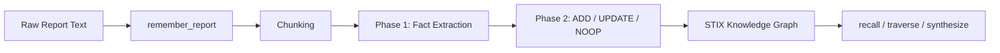
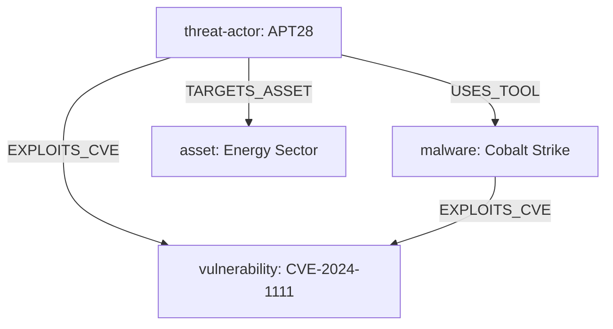

# Ingest Your First CTI Report

**What you will build**: A fully indexed threat intelligence report with extracted STIX entities (threat-actor, malware, vulnerability), queryable graph relationships, and a synthesized threat brief about APT28.

**Time estimate**: 15 minutes

**Prerequisites**: You have completed the [Quickstart (Tutorial 01)](01-quickstart.md). TypeDB is running on `localhost:1729`, Ollama is running with models pulled, and ZettelForge v2.0.0 is installed.



---

## Step 1: Start a Python Session

Open a terminal and start a Python REPL.

```bash
python3
```

Import ZettelForge and create a `MemoryManager` instance.

```python
from zettelforge import MemoryManager

mm = MemoryManager()
```

Expected output:

```
[TypeDB] Connected to localhost:1729 database=zettelforge
```

> [!NOTE]
> If you see `[TypeDB] Connection failed, falling back to JSONL`, confirm TypeDB is running with `typedb server status`. The tutorial works with the JSONL fallback, but TypeDB gives you full STIX 2.1 entity types.

---

## Step 2: Create a Sample Threat Report

Define a threat intelligence report as a Python string. This report describes APT28 using Cobalt Strike to exploit CVE-2024-1111 against the energy sector.

```python
report = """
THREAT INTELLIGENCE REPORT: APT28 Campaign Targeting Energy Sector
Published: 2026-03-15
TLP:AMBER

Executive Summary:
Russian state-sponsored threat actor APT28 (also known as Fancy Bear) has been
observed conducting a sustained cyber espionage campaign against energy sector
organizations in Western Europe. The campaign, active since January 2026, leverages
Cobalt Strike beacons delivered through spear-phishing emails containing weaponized
PDF attachments.

Technical Analysis:
The initial access vector exploits CVE-2024-1111, a critical remote code execution
vulnerability in PDF rendering libraries (CVSS 9.8). Upon successful exploitation,
the payload deploys a Cobalt Strike beacon configured to communicate with C2
infrastructure hosted on compromised legitimate websites.

APT28 operators use Cobalt Strike's built-in lateral movement capabilities to
pivot through victim networks, targeting operational technology (OT) network
segments connected to SCADA systems. The threat actor has been observed
exfiltrating engineering schematics and network topology documents from
compromised energy utilities.

Indicators of Compromise:
- C2 Domain: update-service.energy-grid[.]com
- Cobalt Strike Beacon Hash: a1b2c3d4e5f6a1b2c3d4e5f6a1b2c3d4
- Exploit Payload Hash: 9f8e7d6c5b4a9f8e7d6c5b4a9f8e7d6c
- Spear-phishing Subject: "Q1 2026 Energy Market Compliance Update"

MITRE ATT&CK Mapping:
- T1566.001 - Spear-phishing Attachment
- T1203 - Exploitation for Client Execution (CVE-2024-1111)
- T1071.001 - Web Protocols (Cobalt Strike C2)
- T1021.002 - SMB/Windows Admin Shares (Lateral Movement)

Recommendations:
Patch CVE-2024-1111 immediately. Block the listed IOCs at network perimeter.
Monitor for anomalous SMB traffic between IT and OT network segments.
"""
```

---

## Step 3: Ingest the Report with `remember_report()`

Feed the report into ZettelForge. The `remember_report()` method chunks the text, runs two-phase extraction on each chunk, and stores the results with CTI domain metadata.

```python
results = mm.remember_report(
    content=report,
    source_url="https://intel.example.com/reports/apt28-energy-2026",
    published_date="2026-03-15",
    domain="cti",
    chunk_size=3000
)
```

Expected output:

```
[Extraction] Phase 1: Extracted 5 facts from chunk 0
[Extraction] Phase 2: ADD "APT28 is conducting cyber espionage against energy sector" (importance: 8)
[Extraction] Phase 2: ADD "APT28 uses Cobalt Strike beacons via spear-phishing PDFs" (importance: 9)
[Extraction] Phase 2: ADD "CVE-2024-1111 is a critical RCE in PDF rendering (CVSS 9.8)" (importance: 9)
[Extraction] Phase 2: ADD "APT28 targets OT/SCADA systems in energy utilities" (importance: 8)
[Extraction] Phase 2: ADD "C2 domain: update-service.energy-grid.com" (importance: 7)
[Causal] Extracted 3 triples, stored 3 edges for note note_20260409_...
```

> [!TIP]
> The output shows both phases in action. Phase 1 (extraction) pulls out candidate facts and scores them by importance. Phase 2 (update) compares each fact against existing memory and decides ADD, UPDATE, or NOOP.

---

## Step 4: Inspect the Extraction Results

Print the results to see what ZettelForge created.

```python
print(f"Total memory operations: {len(results)}\n")

for note, status in results:
    if note:
        print(f"[{status.upper()}] {note.id}")
        print(f"  Content:    {note.content.raw[:80]}...")
        print(f"  Domain:     {note.metadata.domain}")
        print(f"  Tier:       {note.metadata.tier}")
        print(f"  Importance: {note.metadata.importance}")
        print(f"  Keywords:   {note.semantic.keywords}")
        print(f"  Entities:   {note.semantic.entities}")
        print()
```

Expected output:

```
Total memory operations: 5

[ADDED] note_20260409_143201_a8f2
  Content:    APT28 is conducting a sustained cyber espionage campaign against energy sector o...
  Domain:     cti
  Tier:       B
  Importance: 8
  Keywords:   ['apt28', 'energy sector', 'cyber espionage', 'western europe']
  Entities:   ['APT28', 'energy sector']

[ADDED] note_20260409_143202_b3c7
  Content:    APT28 uses Cobalt Strike beacons delivered through spear-phishing emails with we...
  Domain:     cti
  Tier:       B
  Importance: 9
  Keywords:   ['apt28', 'cobalt strike', 'spear-phishing', 'beacon']
  Entities:   ['APT28', 'Cobalt Strike']

[ADDED] note_20260409_143203_d1e4
  Content:    CVE-2024-1111 is a critical remote code execution vulnerability in PDF rendering...
  Domain:     cti
  Tier:       B
  Importance: 9
  Keywords:   ['cve-2024-1111', 'rce', 'pdf rendering', 'cvss 9.8']
  Entities:   ['CVE-2024-1111']

[ADDED] note_20260409_143204_f5a9
  Content:    APT28 targets operational technology and SCADA systems in compromised energy util...
  Domain:     cti
  Tier:       B
  Importance: 8
  Keywords:   ['apt28', 'scada', 'ot', 'lateral movement']
  Entities:   ['APT28', 'SCADA']

[ADDED] note_20260409_143205_c2b8
  Content:    C2 domain update-service.energy-grid.com used by APT28 Cobalt Strike beacons...
  Domain:     cti
  Tier:       B
  Importance: 7
  Keywords:   ['c2', 'cobalt strike', 'ioc', 'domain']
  Entities:   ['APT28', 'Cobalt Strike']
```

> [!NOTE]
> Your note IDs and timestamps will differ. The number of operations depends on how the LLM segments the facts. You should see between 4 and 6 ADDED operations.

---

## Step 5: Query TypeDB for STIX Entities

Check that ZettelForge wrote STIX entities into the knowledge graph. Query for the threat-actor, malware, and vulnerability nodes.

```python
from zettelforge import get_knowledge_graph

kg = get_knowledge_graph()

actor_neighbors = kg.get_neighbors("actor", "apt28")
print("=== APT28 Relationships ===")
for neighbor in actor_neighbors:
    print(f"  APT28 --[{neighbor['relationship']}]--> {neighbor['entity_type']}:{neighbor['entity_value']}")

print()

malware_neighbors = kg.get_neighbors("tool", "cobalt strike")
print("=== Cobalt Strike Relationships ===")
for neighbor in malware_neighbors:
    print(f"  Cobalt Strike --[{neighbor['relationship']}]--> {neighbor['entity_type']}:{neighbor['entity_value']}")

print()

vuln_neighbors = kg.get_neighbors("cve", "CVE-2024-1111")
print("=== CVE-2024-1111 Relationships ===")
for neighbor in vuln_neighbors:
    print(f"  CVE-2024-1111 --[{neighbor['relationship']}]--> {neighbor['entity_type']}:{neighbor['entity_value']}")
```

Expected output:

```
=== APT28 Relationships ===
  APT28 --[USES_TOOL]--> tool:cobalt strike
  APT28 --[EXPLOITS_CVE]--> cve:CVE-2024-1111
  APT28 --[TARGETS_ASSET]--> asset:energy sector
  APT28 --[MENTIONED_IN]--> note:note_20260409_143201_a8f2
  APT28 --[MENTIONED_IN]--> note:note_20260409_143202_b3c7

=== Cobalt Strike Relationships ===
  Cobalt Strike --[EXPLOITS_CVE]--> cve:CVE-2024-1111
  Cobalt Strike --[MENTIONED_IN]--> note:note_20260409_143202_b3c7

=== CVE-2024-1111 Relationships ===
  CVE-2024-1111 --[MENTIONED_IN]--> note:note_20260409_143203_d1e4
```

> [!NOTE]
> Notice that ZettelForge created USES_TOOL and EXPLOITS_CVE edges from entity co-occurrence in the report text.

---

## Step 6: Use `recall()` to Find the Ingested Intel

Search memory using natural language. The `recall()` method blends vector similarity search with graph traversal.

```python
results = mm.recall("APT28 cobalt strike energy sector", domain="cti", k=5)

print(f"Found {len(results)} relevant notes:\n")
for note in results:
    print(f"  [{note.id}] (importance={note.metadata.importance})")
    print(f"    {note.content.raw[:100]}...")
    print()
```

Expected output:

```
Found 5 relevant notes:

  [note_20260409_143202_b3c7] (importance=9)
    APT28 uses Cobalt Strike beacons delivered through spear-phishing emails with we...

  [note_20260409_143201_a8f2] (importance=8)
    APT28 is conducting a sustained cyber espionage campaign against energy sector o...

  [note_20260409_143203_d1e4] (importance=9)
    CVE-2024-1111 is a critical remote code execution vulnerability in PDF rendering...

  [note_20260409_143204_f5a9] (importance=8)
    APT28 targets operational technology and SCADA systems in compromised energy util...

  [note_20260409_143205_c2b8] (importance=7)
    C2 domain update-service.energy-grid.com used by APT28 Cobalt Strike beacons...
```

---

## Step 7: Walk the Relationship Chain with `traverse_graph()`

Traverse the knowledge graph starting from APT28 to discover the full attack chain: APT28 uses Cobalt Strike, which exploits CVE-2024-1111.

```python
paths = mm.traverse_graph(start_type="actor", start_value="apt28", max_depth=2)

print(f"Graph traversal found {len(paths)} paths:\n")
for i, path in enumerate(paths):
    chain_parts = []
    for step in path:
        if not chain_parts:
            chain_parts.append(f"{step['from_type']}:{step['from_value']}")
        chain_parts.append(f"--[{step['relationship']}]--> {step['to_type']}:{step['to_value']}")
    print(f"  Path {i+1}: {' '.join(chain_parts)}")
```

Expected output:

```
Graph traversal found 6 paths:

  Path 1: actor:apt28 --[USES_TOOL]--> tool:cobalt strike
  Path 2: actor:apt28 --[USES_TOOL]--> tool:cobalt strike --[EXPLOITS_CVE]--> cve:CVE-2024-1111
  Path 3: actor:apt28 --[EXPLOITS_CVE]--> cve:CVE-2024-1111
  Path 4: actor:apt28 --[TARGETS_ASSET]--> asset:energy sector
  Path 5: actor:apt28 --[MENTIONED_IN]--> note:note_20260409_143201_a8f2
  Path 6: actor:apt28 --[MENTIONED_IN]--> note:note_20260409_143202_b3c7
```

Path 2 shows the complete attack chain from APT28 through Cobalt Strike to CVE-2024-1111.



---

## Step 8: Synthesize a Threat Brief

Use `synthesize()` to generate a brief about APT28 from all ingested memory. The synthesis engine retrieves relevant notes, builds context, and produces a structured answer through the LLM.

```python
result = mm.synthesize(
    query="What do we know about APT28?",
    format="synthesized_brief",
    k=10
)

brief = result["synthesis"]
meta = result["metadata"]
sources = result["sources"]

print("=== APT28 Threat Brief ===\n")
print(brief["summary"])
print(f"\nConfidence: {brief['confidence']}")

print(f"\nThemes:")
for theme in brief["themes"]:
    print(f"  - {theme['name']}: {theme['evidence']}")

print(f"\nSources used: {meta['sources_count']}")
print(f"Model: {meta['model_used']}")
print(f"Latency: {meta['latency_ms']}ms")
```

Expected output:

```
=== APT28 Threat Brief ===

APT28 (Fancy Bear) is a Russian state-sponsored threat actor conducting cyber
espionage against Western European energy sector organizations since January 2026.
The campaign uses Cobalt Strike beacons delivered via spear-phishing with weaponized
PDF attachments exploiting CVE-2024-1111 (CVSS 9.8). The actor targets OT/SCADA
network segments to exfiltrate engineering schematics and network topology data.

Confidence: 0.85

Themes:
  - Initial Access: Spear-phishing with weaponized PDFs exploiting CVE-2024-1111
  - Tooling: Cobalt Strike beacons for C2 and lateral movement
  - Targeting: Energy sector OT/SCADA systems in Western Europe

Sources used: 5
Model: qwen2.5:3b
Latency: 1240ms
```

> [!TIP]
> The `format` parameter controls output structure. Use `"direct_answer"` for quick lookups, `"synthesized_brief"` for structured briefs, `"timeline_analysis"` for chronological views, and `"relationship_map"` for entity mapping.

---

## What You Built

You ingested a raw threat intelligence report and turned it into structured, queryable knowledge:

1. **Chunked ingestion** -- `remember_report()` split the report and ran two-phase extraction on each chunk
2. **Fact extraction** -- The LLM identified 5 high-importance facts and scored them
3. **STIX entity creation** -- The knowledge graph now has `threat-actor:APT28`, `tool:cobalt strike`, `vulnerability:CVE-2024-1111`, and `asset:energy sector` with inferred relationships
4. **Semantic recall** -- `recall()` blends vector similarity and graph traversal for ranked retrieval
5. **Graph traversal** -- `traverse_graph()` walks the relationship chain to map the full attack path
6. **Synthesis** -- `synthesize()` generates an LLM-backed threat brief grounded in your stored intelligence

### Next Steps

- [How to ingest STIX 2.1 bundles from TAXII feeds](../how-to/ingest-news-report.md)
- [How to generate Sigma detection rules from ingested intel](../how-to/store-threat-actor.md)
- [How to set up proactive context injection for your SOC agent](../how-to/integrate-nexus-agent.md)
- [API Reference: MemoryManager](../reference/memory-manager-api.md)

---

## LLM Quick Reference

This section is optimized for LLM agents that need to use ZettelForge's CTI ingestion pipeline programmatically.

**Ingest a report** -- Use `mm.remember_report(content, source_url, published_date, domain="cti", chunk_size=3000)`. Returns `List[Tuple[Optional[MemoryNote], str]]` where each tuple is `(note, status)` and status is one of `"added"`, `"updated"`, `"corrected"`, `"noop"`. The method chunks on sentence boundaries, runs Phase 1 fact extraction (LLM scores importance 1-10, filters by `min_importance`), then Phase 2 update decisions (ADD/UPDATE/DELETE/NOOP against existing memory). Default `max_facts=10` per chunk.

**Recall intel** -- Use `mm.recall(query, domain="cti", k=10)`. Returns `List[MemoryNote]` ranked by blended vector + graph score. The intent classifier automatically adjusts retrieval weights. Superseded notes are excluded by default. For entity-specific lookup, use `mm.recall_entity(entity_type, entity_value)` where `entity_type` is one of: `cve`, `actor`, `tool`, `campaign`, `sector`. Shortcut methods: `mm.recall_cve("CVE-2024-1111")`, `mm.recall_actor("apt28")`, `mm.recall_tool("cobalt strike")`.

**Traverse the graph** -- Use `mm.traverse_graph(start_type, start_value, max_depth=2)`. Returns `List[Dict]` where each item is a path (list of steps). Each step has keys: `from_type`, `from_value`, `relationship`, `to_type`, `to_value`. Valid `start_type` values: `actor`, `tool`, `cve`, `campaign`, `asset`, `note`. Relationships in the graph: `USES_TOOL`, `EXPLOITS_CVE`, `TARGETS_ASSET`, `CONDUCTS_CAMPAIGN`, `MENTIONED_IN`, `SUPERSEDES`.

**Synthesize a brief** -- Use `mm.synthesize(query, format="synthesized_brief", k=10)`. Returns a dict with keys `query`, `format`, `synthesis`, `metadata`, `sources`. The `synthesis` key contains format-specific output. For `"synthesized_brief"`: `summary` (str), `themes` (list of `{name, evidence}`), `confidence` (float). For `"direct_answer"`: `answer` (str), `confidence` (float), `sources` (list of str). Available formats: `direct_answer`, `synthesized_brief`, `timeline_analysis`, `relationship_map`.

**MemoryNote fields** -- Each note has: `id` (str), `content.raw` (str), `semantic.keywords` (list), `semantic.entities` (list), `metadata.domain` (str), `metadata.tier` (str, A/B/C), `metadata.importance` (int, 1-10), `metadata.confidence` (float), `links.superseded_by` (optional str), `links.supersedes` (list).

**Configuration** -- Default LLM is `qwen2.5:3b` via Ollama at `localhost:11434`. Default embedding model is `nomic-embed-text-v2-moe`. TypeDB defaults to `localhost:1729` database `zettelforge`. Override with environment variables: `ZETTELFORGE_LLM_MODEL`, `TYPEDB_HOST`, `TYPEDB_PORT`, `TYPEDB_DATABASE`.
