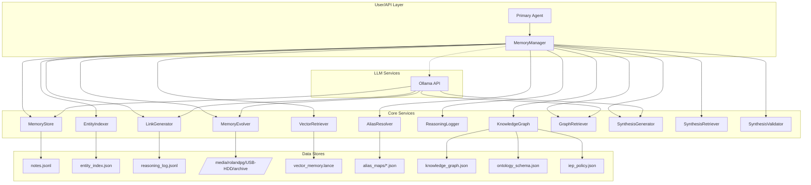
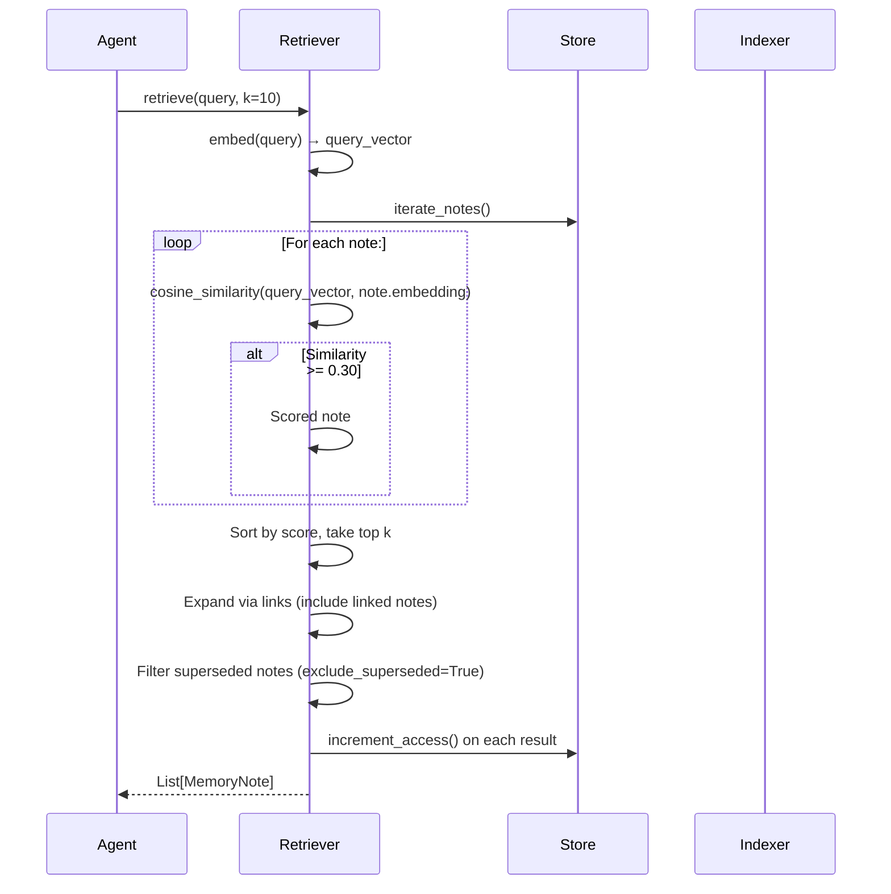
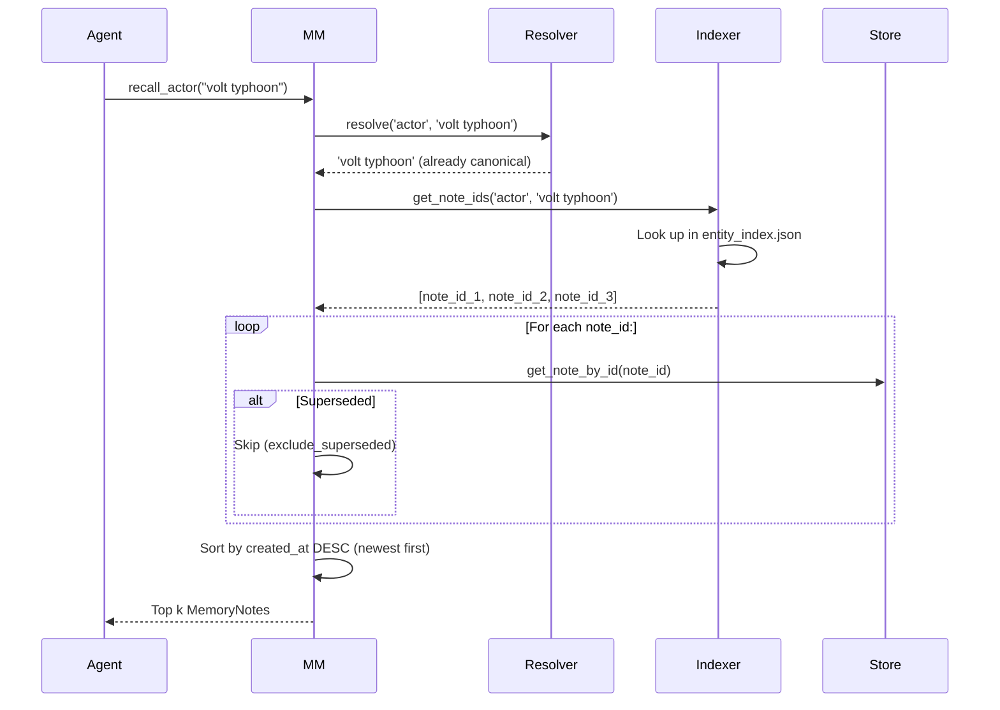
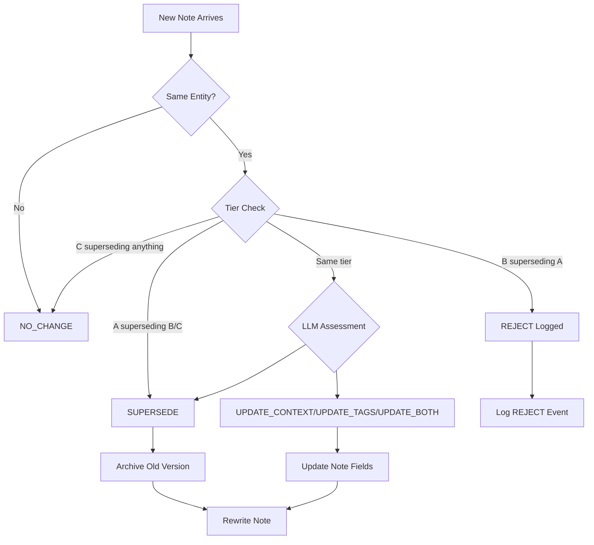

# ThreatRecall — Architecture and System Flow Document

**Version:** 1.5  
**Date:** 2026-04-03  
**Project:** ThreatRecall (built on A-MEM architecture)  
**Foundation:** A-MEM (Agentic Memory) research

---

## System Overview

A-MEM is a zettelkasten-inspired agentic memory system built for Roland Fleet threat intelligence operations. It implements eight core capabilities: entity indexing, deduplication, entity-guided linking, date-aware retrieval (supersedes tracking), alias resolution, epistemic tiering, knowledge graph traversal, and LLM-based answer synthesis. The system stores notes in JSONL format, uses Ollama for LLM enrichment, and leverages LanceDB for vector-based semantic search.

### High-Level Architecture Diagram



---

## System Initialization Narrative

When the system starts (via `memory_init.init_all()` or `get_memory_manager()`):

1. **MemoryStore** initializes JSONL path (`notes.jsonl`) and LanceDB path (`vector_memory.lance/`)
2. **EntityIndexer** loads `entity_index.json` if it exists (27 entities across 11 actors, 3 CVEs, 4 tools, 9 sectors)
3. **AliasResolver** loads alias maps from `alias_maps/actors.json`, `tools.json`, `campaigns.json`
4. **ReasoningLogger** opens `reasoning_log.jsonl` for writing evolution/link decisions
5. **VectorRetriever** initializes LanceDB connection to `memories.lance` table
6. **KnowledgeGraph** loads `knowledge_graph.json` with 45 nodes, 128 edges
7. **SynthesisGenerator** initializes LLM connection to `qwen2.5:3b` model
8. **NoteConstructor** initializes LLM connection to `qwen2.5:3b` model
9. **MemoryManager** ties all components together and registers global instance

The system maintains a **singleton** MemoryManager instance accessible via `get_memory_manager()`.

---

## Request/Event Lifecycle

### Note Creation: `mm.remember(content)`

```mermaid
sequenceDiagram
    participant Agent
    participant MM as MemoryManager
    participant Dedup
    participant Constructor
    participant Store
    participant Indexer
    participant Linker
    participant Evolver
    participant Logger
    
    Agent->>MM: remember(content, source_type)
    
    Note Right of MM: Deduplication Check
    MM->>Dedup: check_duplicate(content)
    alt Duplicate Found
        Dedup-->>MM: is_dup=True, note_id
        MM-->>Agent: (existing, "duplicate_skipped")
        return
    end
    
    Note Right of MM: Note Construction
    MM->>Constructor: enrich(content)
    Constructor->>Ollama: Generate semantic enrichment
    Ollama-->>Constructor: context, keywords, tags, entities
    Constructor->>Ollama: Generate embedding
    Ollama-->>Constructor: 768-dim vector
    Constructor->>Constructor: Assign tier (A/B/C based on source_type)
    Constructor-->>MM: MemoryNote(id, content, semantic, embedding, tier)
    
    Note Right of MM: Storage Write
    MM->>Store: write_note(note)
    Store->>Store: Append to notes.jsonl
    Store->>Store: Index in LanceDB
    
    Note Right of MM: Entity Indexing
    MM->>Indexer: add_note_resolved(note.id, entities)
    Indexer->>Indexer: Update entity_index.json
    Indexer-->>MM: Entity mappings (e.g., "volt typhoon" -> note_id)
    
    Note Right of MM: Link Generation
    MM->>Linker: generate_links(note, candidates)
    Linker->>Linker: Get entity-correlated notes
    Linker->>Ollama: Analyze relationship types
    Ollama-->>Linker: [target_id, relationship, reason]
    Linker-->>MM: Links list
    
    Note Right of MM: Evolution Cycle (Parallel Assessment)
    MM->>Evolver: run_evolution_cycle(note)
    Evolver->>Evolver: Get entity-correlated notes (max 10)
    
    Note Right of Evolver: Parallel Assessment Phase
    par Parallel Assessment
        Evolver->>Ollama: assess(candidate_1)
        Ollama-->>Evolver: decision_1
    and
        Evolver->>Ollama: assess(candidate_2)
        Ollama-->>Evolver: decision_2
    and
        Evolver->>Ollama: assess(candidate_n)
        Ollama-->>Evolver: decision_n
    end
    
    Note Right of Evolver: Sequential Evolution Phase
    loop For each assessment result:
        alt SUPERSEDE
            Evolver->>Evolver: Archive old version to cold storage
            Evolver->>Store: _rewrite_note(updated)
        else UPDATE_CONTEXT/UPDATE_TAGS/UPDATE_BOTH
            Evolver->>Store: _rewrite_note(updated)
        else REJECT
            Evolver->>Logger: Log tier constraint rejection
        end
    end
    
    MM-->>Agent: (note, "created")
```

### Note Retrieval: `mm.recall(query, k=10)`



### Typed Entity Recall: `mm.recall_actor("volt typhoon")`



---

## Component Interaction Patterns

### Entity Indexing Flow

1. **EntityExtractor** scans note content using pattern matching
2. **Known actors/tools**: Regex matches against ~50 actors, ~30 tools
3. **CVEs**: Pattern `CVE-\d{4}-\d{4,}` (case-insensitive)
4. **Campaigns**: Pattern `Operation\s+\w+`
5. **Sectors**: Keyword matching against DIB, Healthcare, MSSP, etc.
6. **Alias Resolution**: Raw entity names passed to `AliasResolver.resolve()`
7. **Canonical Names**: Mapped entities stored in `entity_index.json`

### Evolution Decision Flow



### Link Generation Flow

1. **Candidate Pool**: All existing notes (capped at 20)
2. **Entity Correlation**: Notes sharing same CVE/actor/tool/campaign added to candidates
3. **Prioritization**: Entity-matched candidates appear first in prompt
4. **LLM Prompt**: Note summaries + candidate summaries
5. **Relationship Types**: SUPPORTS, CONTRADICTS, EXTENDS, CAUSES, RELATED
6. **Bidirectional Links**: Generated links added to both notes' `links.related` arrays

---

## Data Transformation Pipeline

```
Raw Content (string)
    ↓
EntityExtractor.extract_all()
    ├─ CVEs → [CVE-2024-3094]
    ├─ Actors → ['muddywater'] (resolved from 'mercury')
    ├─ Tools → ['cobalt strike']
    ├─ Campaigns → ['Operation NoVoice']
    └─ Sectors → ['dib', 'healthcare']
    ↓
NoteConstructor.enrich()
    ├─ LLM → context: "One sentence summary"
    ├─ LLM → keywords: ['cve', 'actor', 'tools']
    ├─ LLM → tags: ['security_ops', 'cti']
    ├─ LLM → embedding: 768-dim vector
    └─ Tier assignment: 'A'/'B'/'C'
    ↓
MemoryStore.write_note()
    ├─ Append to notes.jsonl
    └─ Index in LanceDB
    ↓
EntityIndexer.add_note_resolved()
    └─ Update entity_index.json
    ↓
LinkGenerator.generate_links()
    ├─ LLM analysis of relationships
    └─ Update links.related on both notes
    ↓
MemoryEvolver.run_evolution_cycle()
    ├─ Assess entity-correlated notes
    └─ Apply evolution decisions
    ↓
ReasoningLogger.log_*()
    └─ Write to reasoning_log.jsonl
```

---

## Error Handling and Failure Modes

| Error | Handling | Recovery |
|-------|----------|----------|
| LLM enrichment fails | Falls back to basic keyword extraction | No data loss |
| LanceDB indexing fails | Silently skipped | Vector search unavailable |
| Alias resolver unavailable | Raw names used, graceful degradation | No data loss |
| Cold archive path unavailable | Archive skipped, warning logged | Manual intervention |
| Reasoning logger unavailable | Logging skipped | Reasoning trail incomplete |
| Duplicate detection false negative | Note saved, dedup_log records it | Manual cleanup |

---

## Edge Cases and Boundary Behaviors

| Scenario | Behavior |
|----------|----------|
| **Note evolution limit** | Max 5 evolution hops before NO_CHANGE forced |
| **Evolution candidate cap** | Capped at 20 candidates to prevent runaway LLM calls |
| **Tier B superseding Tier A** | Returns REJECT, logged to reasoning_log.jsonl |
| **Tier C attempting supersession** | Always returns NO_CHANGE, never triggers evolution |
| **Same CVE saved twice** | Second save returns `(existing, "duplicate_skipped")` |
| **Alias collision** | Raises ValueError, must be resolved in alias_maps/*.json |
| **Empty evolution candidates** | Skips evolution, logs "No related notes found" |
| **Archive path not available** | Archive skipped, continues processing |

---

## System Boundaries

| System | Responsibility |
|--------|----------------|
| **A-MEM (memory/)** | Note storage, indexing, linking, evolution |
| **Ollama** | LLM-based enrichment, embedding, link analysis |
| **LanceDB** | Vector indexing and semantic search |
| **Agent (primary)** | Orchestration, content input, retrieval queries |
| **Systemd timers** | Scheduled daily/weekly maintenance |

**What A-MEM does NOT do:**
- Cross-machine synchronization
- User interface or visualization
- Authentication or authorization
- External API integration (except Ollama)
- Multi-tenant support

---

## Integration Points

### External Services

| Service | Integration | Authentication |
|---------|-------------|----------------|
| Ollama (local) | LLM enrichment, embedding generation | None (localhost) |
| LLM Server | Embedding generation | None (localhost) |

### Data Exports

| Destination | Format | Purpose |
|-------------|--------|---------|
| `/media/rolandpg/USB-HDD/archive/` | JSONL | Cold storage of superseded versions |
| `notes.jsonl` | JSONL | Primary note storage |
| `entity_index.json` | JSON | Entity → note ID mapping |
| `reasoning_log.jsonl` | JSONL | Evolution/link audit trail |
| `dedup_log.jsonl` | JSONL | Deduplication events |
| `alias_observations.json` | JSON | Auto-update alias tracking |

---

*End of Architecture Document*
*ThreatRecall — built on A-MEM architecture. See also: THREATRECALL_PRODUCT_PLAN.md, PRD.md*
