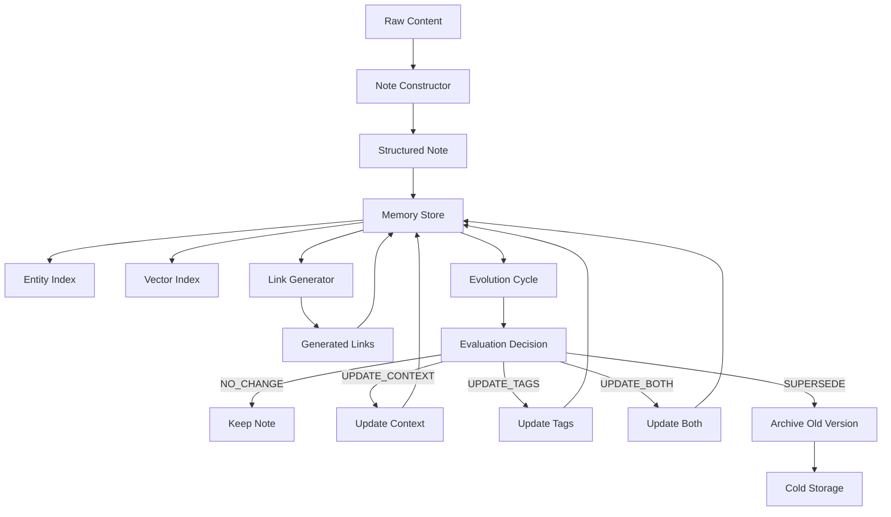
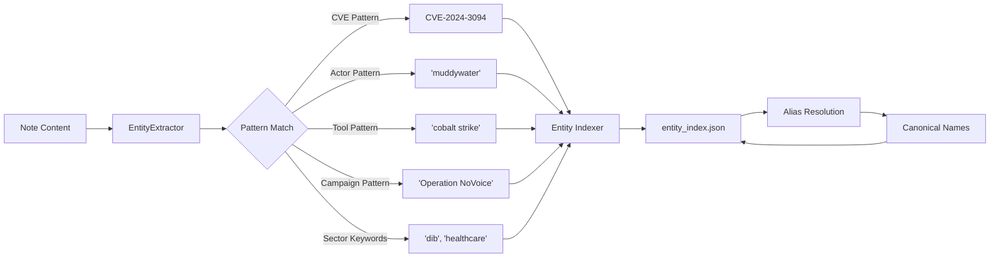
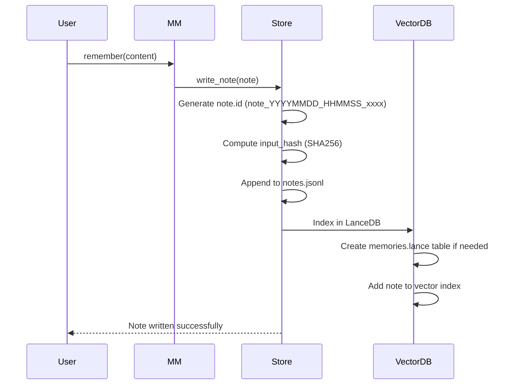
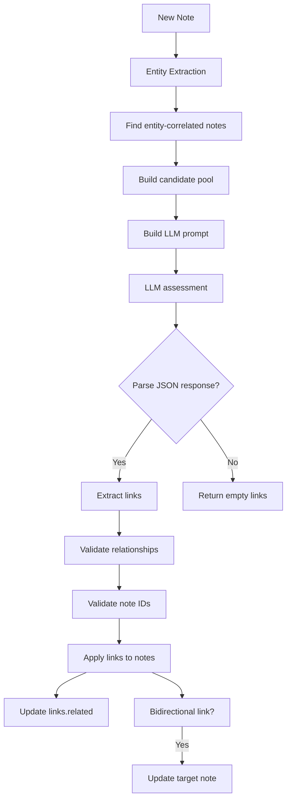
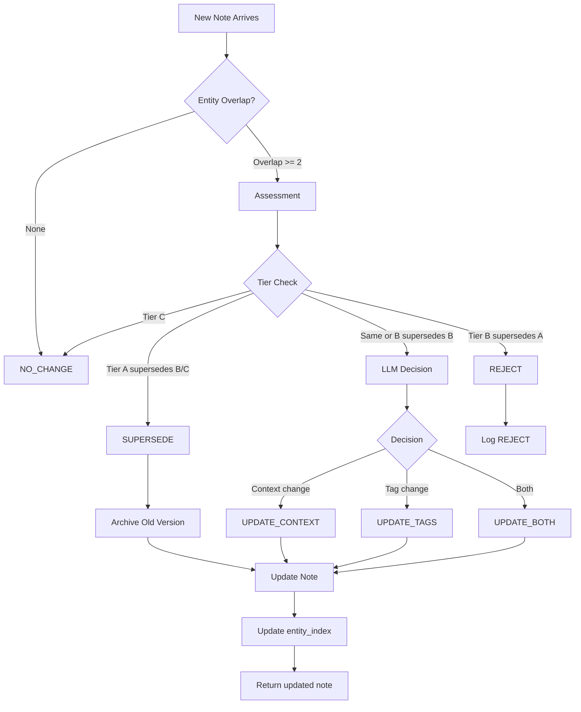

# A-MEM Data Flow Document

**Version:** 1.3  
**Date:** 2026-04-02  
**Project:** A-MEM (Agentic Memory)

---

## 1. Data Lifecycle Overview

A-MEM follows a zettelkasten-inspired data lifecycle: raw content enters the system, is enriched with semantic metadata, indexed by entities, linked to related content, and may evolve over time. Notes that are superseded are archived to cold storage.



---

## 2. Entity Index Data Flow

### Entity Extraction Flow



### Entity Index Structure

**File:** `entity_index.json`

```json
{
  "cve": {
    "cve-2024-3094": ["note_20260401_120000_1234", "note_20260402_080000_5678"]
  },
  "actor": {
    "volt typhoon": ["note_20260401_090000_1111", "note_20260401_150000_2222"],
    "muddywater": ["note_20260402_100000_3333"]
  },
  "tool": {
    "cobalt strike": ["note_20260401_110000_4444"],
    "manageengine": ["note_20260402_090000_5555"]
  },
  "campaign": {},
  "sector": {
    "dib": ["note_20260401_140000_6666", "note_20260402_110000_7777"],
    "healthcare": ["note_20260402_120000_8888"]
  }
}
```

**Entity → Note ID Mapping:**
- 3 CVEs indexed
- 11 actors indexed
- 4 tools indexed
- 0 campaigns indexed
- 9 sectors indexed
- **Total: 27 entity mappings**

---

## 3. Note Storage Data Flow

### Note Schema Structure

**File:** `memory/note_schema.py`

```json
{
  "id": "note_20260402_180000_1234",
  "version": 1,
  "created_at": "2026-04-02T18:00:00.000000",
  "updated_at": "2026-04-02T18:00:00.000000",
  "evolved_from": null,
  "evolved_by": [],
  "content": {
    "raw": "Full content text here...",
    "source_type": "cti_ingestion",
    "source_ref": "cisa_advisory_aa24_038a"
  },
  "semantic": {
    "context": "One sentence summary of the note.",
    "keywords": ["cve", "actor", "tools"],
    "tags": ["security_ops", "cti"],
    "entities": ["Volt Typhoon", "CVE-2024-3094"]
  },
  "embedding": {
    "model": "nomic-embed-text-v2-moe",
    "vector": [0.123, -0.456, ..., 0.789],
    "dimensions": 768,
    "input_hash": "abc123def456"
  },
  "links": {
    "related": ["note_20260401_120000_1111", "note_20260402_090000_2222"],
    "superseded_by": null,
    "supersedes": [],
    "causal_chain": []
  },
  "metadata": {
    "access_count": 0,
    "last_accessed": null,
    "evolution_count": 0,
    "confidence": 1.0,
    "ttl": null,
    "domain": "security_ops",
    "tier": "A"
  }
}
```

### Note Storage Flow



### Storage Format

**notes.jsonl:**
```
{"id": "...", "content": {...}, "semantic": {...}, "metadata": {...}}
{"id": "...", "content": {...}, "semantic": {...}, "metadata": {...}}
{"id": "...", "content": {...}, "semantic": {...}, "metadata": {...}}
```

**Format characteristics:**
- Append-only (no in-place updates)
- Each line is a complete JSON object
- `version` field tracks note evolution
- `evolved_by` and `evolved_from` track evolution chain

---

## 4. Vector Storage Data Flow

### LanceDB Schema

**File:** `memory/vector_memory.py`

```python
pa.schema([
    ('id', pa.string()),              # UUID for chunk
    ('text', pa.string()),            # Chunk content
    ('embedding', pa.list_(pa.float32(), 768)),  # Nomic embedding
    ('content_hash', pa.string()),    # SHA256 for dedup
    ('timestamp', pa.string()),       # ISO timestamp
    ('source', pa.string()),          # 'memory', 'session', 'briefing'
    ('session_key', pa.string()),     # Session identifier
    ('tags', pa.list_(pa.string())),  # User tags
    ('metadata', pa.string()),        # JSON metadata
])
```

### Vector Flow Diagram

```mermaid
flowchart TD
    A[Note Content] --> B[Text Chunking]
    B -->|> 2000 chars| C[Split into chunks]
    B -->|<= 2000 chars| D[Single chunk]
    
    C --> E[Embedder]
    D --> E
    
    E --> F[Get embedding from cache?]
    F -->|Yes| G[Use cached]
    F -->|No| H[Generate via Ollama]
    H --> I[Store in cache]
    I --> G
    
    G --> J[LanceDB add()]
    J --> K[Insert to memories.lance]
    K --> L[Return chunk IDs]
```

### Embedding Generation

```mermaid
flowchart LR
    A[Note text] --> B[EmbeddingGenerator.embed()]
    B --> C{LLM Server available?}
    C -->|Yes| D[POST /embedding]
    C -->|No| E[Ollama.embeddings()]
    
    D --> F[768-dim vector]
    E --> F
    
    F --> G[Cache by content_hash]
    G --> H[Return embedding]
```

---

## 5. Link Generation Data Flow

### Link Generation Process



### Link Types

| Relationship | Meaning |
|------------|---------|
| `SUPPORTS` | Corroborates or confirms information |
| `CONTRADICTS` | Conflicts or refutes information |
| `EXTENDS` | Builds upon or adds nuance |
| `CAUSES` | Has causal relationship |
| `RELATED` | Topically connected |

### Link Storage Format

```json
{
  "id": "note_20260402_180000_1234",
  "links": {
    "related": [
      "note_20260401_120000_1111",
      "note_20260401_150000_2222"
    ],
    "superseded_by": null,
    "supersedes": [],
    "causal_chain": []
  }
}
```

---

## 6. Evolution Data Flow

### Evolution Decision Process



### Evolution Storage

**Archive file:** `/media/rolandpg/USB-HDD/archive/note_20260402_180000_1234_v3.jsonl`

```json
{
  "id": "note_20260402_180000_1234",
  "version": 3,
  "content": {...},
  "semantic": {...},
  "links": {...},
  "metadata": {
    "evolution_count": 3,
    "confidence": 0.95
  }
}
```

**Supersession tracking:**
- Old note: `superseded_by: "note_20260402_190000_5678"`
- New note: `supersedes: ["note_20260402_180000_1234"]`

---

## 7. Reasoning Log Data Flow

### Reasoning Log Schema

**File:** `reasoning_log.jsonl`

**Event Types:**
- `evolution_decision` - Evolution assessment result
- `link_created` - Link generation event
- `tier_assignment` - Tier assignment on note save
- `alias_added` - Auto-added alias from observations

### Event Format Examples

**Evolution Decision:**
```json
{
  "timestamp": "2026-04-02T18:00:00.000000",
  "event_type": "evolution_decision",
  "note_id": "note_20260402_180000_1234",
  "superseded_note_id": "note_20260401_120000_1111",
  "decision": "SUPERSEDE",
  "reason": "New Tier A supersedes existing Tier B note",
  "tier": "A",
  "extra": {
    "existing_tier": "B",
    "new_tier": "A"
  }
}
```

**Link Created:**
```json
{
  "timestamp": "2026-04-02T18:00:00.000000",
  "event_type": "link_created",
  "from_note": "note_20260402_180000_1234",
  "to_note": "note_20260401_120000_1111",
  "relationship": "EXTENDS",
  "reason": "Both discuss CVE-2024-3094 with different technical details",
  "tier": "A"
}
```

**Tier Assignment:**
```json
{
  "timestamp": "2026-04-02T18:00:00.000000",
  "event_type": "tier_assignment",
  "note_id": "note_20260402_180000_1234",
  "tier": "A",
  "source_type": "cisa_advisory",
  "auto": true,
  "override": false
}
```

---

## 8. Alias Resolution Data Flow

### Alias Map Structure

**File:** `memory/alias_maps/actors.json`

```json
{
  "_meta": {"version": "1.0"},
  "aliases": {
    "muddywater": {
      "mitre_id": "G0069",
      "names": [
        "muddywater", "mercury", "muddy water",
        "temp.zagros", "seedworm", "static kitten"
      ]
    },
    "volt typhoon": {
      "mitre_id": "G1017",
      "names": ["volt typhoon", "volty typhoon", "vult typhoon"]
    }
  }
}
```

### Alias Resolution Flow

```mermaid
flowchart TD
    A[Raw entity name] --> B{Alias map exists?}
    B -->|No| C[Return raw.lower().strip()]
    B -->|Yes| D{Reverse map exists?}
    
    D -->|No| C
    D -->|Yes| E{Key in reverse map?}
    
    E -->|No| C
    E -->|Yes| F[Return canonical]
    
    C --> G[Entity indexed with raw name]
    F --> H[Entity indexed with canonical name]
```

### Auto-Update Mechanism (Phase 3.5)

**File:** `alias_observations.json`

```json
{
  "actor": {
    "muddywater": {
      "mercury": ["note_1", "note_2", "note_3"]
    }
  }
}
```

**Auto-add threshold:** 3 observations

**Process:**
1. `AliasManager.observe('actor', 'muddywater', 'mercury', note_id)`
2. Increment observation count, save to disk
3. If count >= 3, call `AliasResolver.add_alias()`
4. Add 'mercury' to muddywater's names array
5. Update both alias map and reverse map
6. Clear observations for this pair

---

## 9. Data Egress Points

### Export Formats

| Format | Destination | Purpose |
|--------|-------------|---------|
| JSONL | `notes.jsonl` | Primary storage |
| JSON | `entity_index.json` | Entity lookup |
| JSONL | `reasoning_log.jsonl` | Audit trail |
| JSONL | `/media/rolandpg/USB-HDD/archive/*.jsonl` | Superseded versions |
| JSON | `dedup_log.jsonl` | Deduplication events |
| JSON | `alias_observations.json` | Auto-update tracking |

### Export Triggers

| Action | Export Trigger |
|--------|----------------|
| Note creation | Append to notes.jsonl |
| Entity extraction | Update entity_index.json |
| Link generation | Update notes.jsonl (bidirectional) |
| Evolution | Archive to cold storage |
| Tier assignment | Append to reasoning_log.jsonl |
| Alias observation | Update alias_observations.json |
| Deduplication | Append to dedup_log.jsonl |

---

## 10. Data Retention Policies

| Data Type | Retention | Deletion Trigger |
|-----------|-----------|------------------|
| Active notes | Indefinite | Never (only superseded) |
| Superseded versions | 180 days | Pruning to cold storage |
| Evolution decisions | 180 days | Prune old entries |
| Link decisions | 180 days | Prune old entries |
| Tier assignments | 180 days | Prune old entries |
| Alias observations | Indefinite | Auto-add threshold reached |

---

## 11. PII and Sensitive Data

### Classification

| Data Type | Sensitivity | Masking Applied |
|-----------|-------------|-----------------|
| CVE-IDs | Public | None |
| Actor names | Public | None |
| Tool names | Public | None |
| Email addresses | PII | Not stored |
| User IDs | PII | Not stored |
| IP addresses | Sensitive | May be stored in raw content |
| Threat actor IOCs | Sensitive | Stored in raw content |

**Storage guidelines:**
- PII (emails, user IDs) not stored in structured fields
- IOCs may appear in raw content (threat actor IOCs)
- No encryption at rest (single-machine homelab)

---

*End of Data Flow Document*
