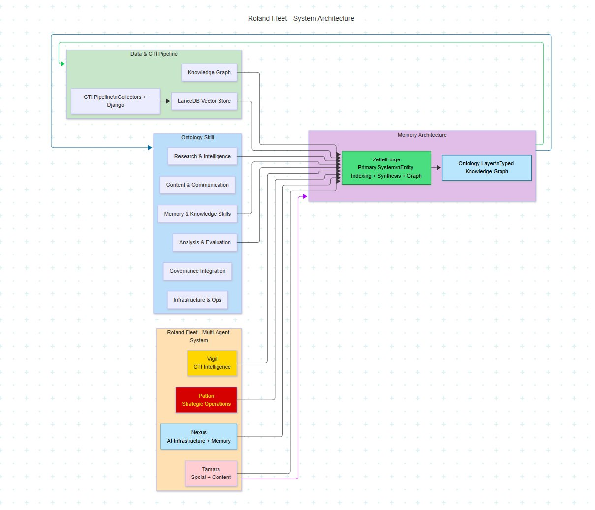

# ThreatRecall API

Cybersecurity-native agent memory system API with tenant isolation, OCSF audit logging, and Kubernetes-ready deployment.

[](https://github.com/rolandpg/threatrecall-api/actions/workflows/ci.yml)
[](https://github.com/rolandpg/threatrecall-api/actions/workflows/docker.yml)
[](https://github.com/rolandpg/threatrecall-api/releases)

## System Architecture



## Overview

ThreatRecall API provides **Memory-as-a-Service** for cybersecurity operations. Built on the A-MEM (Agentic Memory) architecture, it offers:

- **Semantic search** across threat intelligence notes
- **Entity extraction** and linking (CVEs, threat actors, tools)
- **Multi-tenant isolation** with dedicated storage per tenant
- **OCSF-compliant audit logging** for security operations
- **Vector-based retrieval** using LanceDB and Ollama embeddings

## Quick Start

### Docker Compose (Local Development)

```bash
git clone https://github.com/rolandpg/threatrecall-api.git
cd threatrecall-api

# Start with Docker Compose
docker-compose up --build

# Create a tenant
curl -X POST http://localhost:8000/admin/tenants \
  -H "Content-Type: application/json" \
  -d '{"tenant_id": "acme-corp", "tenant_name": "Acme Corp"}'

# Store a memory
curl -X POST http://localhost:8000/api/v1/acme-corp/remember \
  -H "Authorization: Bearer tr_live_xxx" \
  -H "Content-Type: application/json" \
  -d '{"content": "APT29 using PowerShell remoting for lateral movement"}'

# Search memories
curl -X POST http://localhost:8000/api/v1/acme-corp/recall \
  -H "Authorization: Bearer tr_live_xxx" \
  -H "Content-Type: application/json" \
  -d '{"query": "APT29 lateral movement"}'
```

### Kubernetes (Production)

```bash
# Deploy to production
kubectl apply -k k8s/overlays/production/

# Verify deployment
kubectl get pods -n threatrecall-production
kubectl get svc -n threatrecall-production
```

## API Reference

### Authentication

All API requests require a Bearer token:

```
Authorization: Bearer tr_live_<token>
```

### Endpoints

| Method | Endpoint | Description |
|--------|----------|-------------|
| GET | `/health` | Health check (no auth) |
| POST | `/admin/tenants` | Create tenant |
| POST | `/admin/tenants/{id}/rotate-key` | Rotate API key |
| POST | `/api/v1/{tenant}/remember` | Store memory |
| POST | `/api/v1/{tenant}/recall` | Search memories |
| GET | `/api/v1/{tenant}/notes` | List notes |
| GET | `/api/v1/{tenant}/notes/{id}` | Get note by ID |
| GET | `/api/v1/{tenant}/health` | Tenant health |

Interactive API documentation available at `/api/docs` (Swagger UI).

### Request/Response Examples

**Store Memory:**
```json
POST /api/v1/acme-corp/remember
{
  "content": "CVE-2024-1234 exploited by APT28 targeting Exchange servers",
  "metadata": {
    "source": "CISA Alert AA24-038A",
    "tlp": "TLP:AMBER"
  },
  "options": {
    "extract_entities": true
  }
}
```

**Response:**
```json
{
  "data": {
    "note_id": "note_20240405_120000_1234",
    "content": "CVE-2024-1234 exploited by APT28 targeting Exchange servers",
    "created_at": "2024-04-05T12:00:00Z",
    "entities": [
      {"type": "entity", "name": "CVE-2024-1234", "confidence": 0.95},
      {"type": "entity", "name": "APT28", "confidence": 0.92}
    ],
    "linked_notes": ["note_20240401_080000_5678"]
  },
  "meta": {
    "request_id": "req_abc123",
    "timestamp": "2024-04-05T12:00:00Z"
  }
}
```

## Architecture (Updated 2026-04-05)

```
┌─────────────────┐     ┌──────────────────┐     ┌─────────────────┐
│   API Gateway   │────▶│  ThreatRecall    │────▶│   LanceDB       │
│   (Ingress)     │     │  API (FastAPI)   │     │   (Vectors)     │
└─────────────────┘     └──────────────────┘     └─────────────────┘
                               │
                               ▼
                        ┌──────────────────┐
                        │  MemoryManager   │
                        │  (A-MEM Core)    │
                        └──────────────────┘
                               │
          ┌────────────────────┼────────────────────┐
          ▼                    ▼                    ▼
   ┌─────────────┐     ┌─────────────┐     ┌─────────────┐
   │  JSONL      │     │  Entity     │     │  Vault      │
   │  Storage    │     │  Indexer    │     │  Secrets    │
   └─────────────┘     └─────────────┘     └─────────────┘
```

## Configuration

Environment variables:

| Variable | Default | Description |
|----------|---------|-------------|
| `TR_DATA_DIR` | `/data/threatrecall` | Data storage path |
| `TR_SECRETS_BACKEND` | `env` | Secrets backend (env/vault) |
| `TR_LOG_LEVEL` | `INFO` | Logging level |
| `TR_API_WORKERS` | `4` | Uvicorn workers |
| `TR_VAULT_ADDR` | `http://localhost:8200` | Vault address |

## Development

### Setup

```bash
python -m venv venv
source venv/bin/activate
pip install -r requirements.txt
```

### Testing

```bash
# Unit tests
export PYTHONPATH=src
pytest tests/unit/ -v

# Integration tests (requires Ollama)
export TR_DATA_DIR=/tmp/threatrecall-test
pytest tests/integration/ -v
```

### Running Locally

```bash
export TR_SECRETS_BACKEND=env
export TR_DATA_DIR=/tmp/threatrecall-dev
export PYTHONPATH=src

python run_dev.py
```

## Production Checklist

- [x] Docker multi-arch images
- [x] Kubernetes manifests with Kustomize
- [x] Horizontal Pod Autoscaling (3-10 replicas)
- [x] Pod Disruption Budget (min 2 available)
- [x] Secrets management (Vault CSI)
- [x] Monitoring (Prometheus/Grafana)
- [x] Backup strategy (Velero)
- [x] CI/CD pipeline (GitHub Actions)
- [x] Security scanning (Trivy)
- [ ] Custom domain & TLS certificates
- [ ] Rate limiting (Redis backend)
- [ ] Distributed tracing (Jaeger)

## Documentation

- [Architecture](docs/ARCHITECTURE.md) — System design
- [Secrets Management](docs/SECRETS.md) — Vault setup
- [Monitoring](docs/MONITORING.md) — Prometheus/Grafana
- [Backup & DR](docs/BACKUP.md) — Velero procedures
- [Development Status](DEVELOPMENT_STATUS.md) — Roadmap

## Governance Compliance

| Document | Status | Notes |
|----------|--------|-------|
| GOV-003 (Configuration) | ✅ | Pydantic Settings |
| GOV-005 (API Standards) | ✅ | Error envelopes, pagination |
| GOV-010 (Deployment) | ✅ | Kubernetes, Docker |
| GOV-011 (Testing) | ✅ | Unit + integration tests |
| GOV-012 (Logging) | ✅ | OCSF class 6002 |
| GOV-014 (Secrets) | ✅ | Vault integration |
| GOV-019 (Isolation) | ✅ | Per-tenant storage |
| GOV-021 (Data Classification) | ✅ | TLP enum |

## License

MIT License — See [LICENSE](LICENSE) file.

## Acknowledgments

- A-MEM bundled in `amem/` (core memory engine)
- Embeddings via [Ollama](https://ollama.ai)
- Vector storage via [LanceDB](https://lancedb.com)

---

**Made by Roland Fleet** — Cybersecurity operations infrastructure for the AI era.
